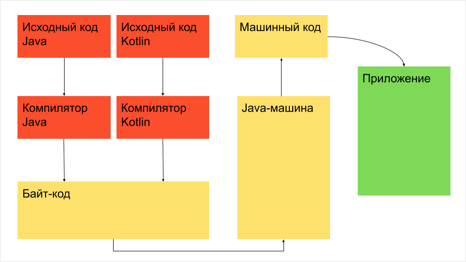

# Знакоство с Kotlin и базовый синтаксис

## Общие сведения о языке

Kotlin — **статически типизированный**, объектно-ориентированный язык программирования (с поддержкой процедурного программирования ), работающий поверх Java Virtual Machine и разрабатываемый компанией JetBrains. Также компилируется в JavaScript и в исполняемый код ряда платформ через инфраструктуру LLVM. Язык назван в честь острова Котлин в Финском заливе, на котором расположен город Кронштадт.

Основные возможности и преимущества Kotlin:

- компилириуется в байткод JVM или в JavaScript
- программы могут использовать все существующие Java-фреймворки и библиотеки. Kotlin можно интегрировать с Maven, Gradle и другими системами сборки
- язык прост для изучения
- исходный код открыт
- язык null-безопасен

Так как Kotlin был изначально спроектирован как JVM-язык, полностью совместимый с Java и наоборот, вы без труда можете наследоваться от существующих Java-классов, обращаться к ним и применять Java-аннотации к вашим Kotlin-классам и методам.
Прежде всего,  IntelliJ компилирует код Kotlin, используя компилятор kotlinc-jvm. Это означает, что IntelliJ транслирует код на Kotlin в байт-код, язык, на котором "разговаривает" JVM.

<p align="center">
  
</p>

## Базовый синтаксис

### Создание стартового проекта

Создадим новый проект с поддержкой Kotlin в IntelliJ IDEA

<p align="center">
  
</p>

Далее в папке `src` создайте пакет и создайте в нем `Kotlin File`.

В файле вы увидите запись

```kotlin Main.kt
package example
```

Как и в Java, в языке Kotlin файлы и классы объединяются в пакеты. Функциональность пакетов в обоих языках идентична, за исключением того, что в Kotlin не обязательно (но крайне желательно), чтобы пакеты повторяли структуру директорий на диске.

Как и в Java, для запуска проекта нам необходимо создать точку входа - метод `main()`.

В Kotlin функция `main()` имеет две возможных сигнатуры

```kotlin
package example

// Первая сигнатура
fun main(args: Array<String>) {
    println("Hello, Kotlin!")
}

// Вторая сигнатура
fun main() {
    println("Hello, Kotlin!")
}
```

Первое что мы можем заметить  ключевое слово `fun`, которым в Kotlin помечаются **функции**.

В отличие от Java, в которой используется термин **метод**, в Kotlin используется термин **функция**. Это связано с тем, что согласно идеологии языка Java, весь исполняемый код находится внутри классов. Таким образом, в Java нет функций вне объекта того или иного класса (вопрос статических функций оставим в стороне).

В языке Kotlin поддерживается механизм функций верхнего уровня (top-level functions).

*Понятие "верхнего уровня" (top-level) не стоит путать с понятием "высшего порядка" (higher-order)*

Функции верхнего уровня - это функции, которые определяются в файле вне других функций, объектов, классов или интерфейсов, сами по себе, просто внутри пакета.

Но здесь кроется один нюанс - язык Kotlin должен быть совместим с Java и выполняется внутри JVM. Поэтому, "под капотом" вместо функции верхнего уровня будет создан класс со статическим методом.

Создадим файл MyFile и внутри него определим функцию myFunc(). Код на языке Kotlin будет выглядеть следующим образом

```kotlin
package example

fun myFunc() {
    println("Hello!")
}
```

Теперь в IDEA выберем пункт меню `Tools->Kotlin->Show Kotlin Bytecode` и в открывшемся окне справа нажмем на кнопку `Decompile`, после чего мы увидим java-код, который будет идентичен коду на Kotlin с точки зрения байткода

```java
public final class MyFileKt {
   public static final void myFunc() {
      String var0 = "Hello!";
      boolean var1 = false;
      System.out.println(var0);
   }
}
```

**Важно понимать, что многие "фишки" языка Kotlin существуют лишь на уровне исходного кода, для удобства разработчика**

Продолжаем разбирать исходный код стартового проекта. Строка 

```kotlin
fun main(args: Array<String>) {
```

говорит нам о том, что в Kotlin используется **Pascal notation**, то есть объявления вида `name: type`. Аргументы отделяются друг от друга запятой.

Массивы в Kotlin моделируются обобщенным классом `Array<T>`. Более подробно мы рассмотрим массивы позже.

Далее, рассмотрим строку

```kotlin
println("Hello, Kotlin!")
```

Обратите внимание, что для вызова функции `println()` мы не подключали никаких библиотек.

Классы и утилиты Kotlin содержатся внутри стандартной библиотеки Kotlin (**Kotlin Standard Library**). Она содержит ключевые компоненты языка Kotlin.

В каждый kotlin-файл по умолчанию импортируются следующие пакеты, которые входят в стандартную библиотеку Kotlin:

- `kotlin.*`
- `kotlin.annotation.*`
- `kotlin.collections.*`
- `kotlin.comparisons.*`
- `kotlin.io.*`
- `kotlin.ranges.*`
- `kotlin.sequences.*`
- `kotlin.text.*`

Также, если целевой платформой Kotlin является JVM (как в нашем случае), то дополнительно импортируются следующие пакеты:

- `java.lang.*`
- `kotlin.jvm.*`

Таким образом, мы можем использовать большое количество готовых классов и функций без необходимости их явно импортировать.

Ну и последнее, на что стоит обратить внимание - нет нужны ставить `;` после каждой инструкции (есть два исключения, но пока не будем их касаться)

## Типы данных

Главным отличием Kotlin от Java в вопросе типов данных является то, что **в Kotlin нет примитивных типов** - всё является объектом.

В Kotlin существуют следующие встроенные группы типов данных:

- numbers
- booleans
- characters
- strings
- arrays

### Целочисленные типы

Группа **numbers** включает целочисленные типы

- `Byte` (8 бит)
- `Short` (16 бит)
- `Int` (32 бита)
- `Long` (64 бита)

При выведении типов, если целочисленное значение переменной не превышает максимальное значение `Int`, то компилятор автоматически выводит тип `Int`. Если значение превышает `Int`, то автоматически выводится `Long`. Для автоматического выведения `Long`, укажите суффикс `L` после значения.

```kotlin
val one = 1 // Int
val threeBillion = 3000000000 // Long
val oneLong = 1L // Long
val oneByte: Byte = 1
```

### Типы с плавающей точкой

Кроме этого, группа **numbers** включает типы с плавающей точкой

- `Float` (32 бит), точность 6-7 знаков после запятой
- `Double` (64 бит), точность 15-16 знаков после запятой

При выведении типов, компилятор будет выводить тип `Double`. Для явного указания типа `Float`, используйте суффикс `F` или `f`.

ВАЖНО! В Kotlin нет расширяющего преобразования чисел, как в Java. Таким образом, если в Java следующий код будет работать корректно

```java
int a = 5;
long b = 5L;
float c = 5.5f;
double d = 5.5;

foo(a);
foo(b);
foo(c);
foo(d);

void foo(double d) {
    System.out.println(d);
}
```

то в Kotlin корректным будет только последний вызов функции

```kotlin
val a: Int = 5
val b: Long = 5L
val c: Float = 5.5f
val d: Double = 5.5

foo(a) // ОШИБКА!
foo(b) // ОШИБКА!
foo(c) // ОШИБКА!
foo(d) // OK

fun foo(d: Double) {
    println(d)
}
```

Для преобразования одного числового типа в другой используйте методы `toXXX()`, которые есть во всех числовых типах

```kotlin
val num = 5
val longnum: Long = num.toLong()
```

В версии Kotlin 1.5 появилась стабильная реализация **unsigned** целочисленных типов (`UByte`, `UShort`, `UInt`, `ULong`).

### Булевые типы

Тип `Boolean` представляет булевые объекты, которые принимают только два значения: `true` и `false`. Объекты типа `Boolean?` могут иметь значения `null`.

### Символы

Символы представлены в Kotlin типом Char. Символьные литералы заключаются в одинарные скобки: `'X'`.

Специальные символы начинаются с `\`. Поддерживаются следующие управляющие последовательности: `\t \b \n \r \' \" \\ \$`

Если символов является цифра, вы можете явно преобразовать ее в Int с помощью функции `digitToInt()`

```kotlin
val ch: Char = '5'
val num: Int = ch.digitToInt()
```

### Строки

Строки в Kotlin представлены типом `String`. Как правило, строковое значение это последовательность символов, заключенных в двойные кавычки `"`

```kotlin
val str: String = "string 1234"
```

Элементы строки являются символами, к которым вы можете получить доступ с помощью оператора индексирования `str[i]`. Вы можете проитерировать строку с помощью цикла `for`

```kotlin
val str: String = "string 1234"
println(str[2])

for (ch in str) {
    println(ch)
}
```

В Kotlin, как и в Java, строки **неизменяемы** (immutable).

Для конкатенации строк можно использовать оператор `+`. Вы можете склеивать строки со значениями других типов, если первым операндом в выражении будет строка.

```kotlin
val s = "abc" + 1
println(s + "def") // abc1def
```

#### Строковые литералы

В Kotlin предусмотрены два типа строковых литералов:

- строки с управляющими последовательностями
- сырые (raw) строки, которые могут быть многострочными и содержать произвольный текст.

Сырые строки определяются тройными кавычками `"""`, не содержат управляющих последовательностей, могут быть многострочными и содержать любые символы

```kotlin
val txt = """
    !@##$
    #$#%^
    We watch the shows, we watch the stars
    On videos for hours and hours
    We hardly need to use our ears
    How music changes through the years
    %$^&^*&^*(*
    &(/m/m/m/m/
"""
```

#### Строковые шаблоны

Строковые литералы могут содержать шаблонные выражения - фрагменты кода, которые могут быть вычислены и результат склеен со строкой. Шаблонное выражение начинается со знака доллара `$` и далее содержать идентификатор

```kotlin
val i = 10
println("i = $i") // i = 10
```
или выражение в фигурных скобках `{}`

```kotlin
val i = "abc"
println("$i length is ${i.length}") // abc length is 3
```

Вы можете использовать шаблоны и в сырых строках также. Если вам нужно написать символ `$` в сырой строке, то следует использовать следующий синтаксис

```kotlin
val price = """
    The price of this item is ${'$'}1.65
    """ // The price of this item is $1.65
```

### Массивы

Массивы в Kotlin представлены классом `Array<T>`. Объекты этих классов имеют функции `get` и `set`, которые не используются напрямую, а доступ к элементам происходит через оператор `[]`, а также **свойство** (property) `size`, а также другие полезные функции.

Для создания массивов, используйте функцию `arrayOf()` и передавайте ей значения, с которыми вы хотите создать массив. Если вы хотите создать массив с элементами, содержащими `null`, то используйте функцию `arrayOfNulls()`.

Другая возможность создания массива - использовать конструктор класса `Array`, который принимает размер массива и функцию, которая принимает индекс массива и возвращает значение, которое будет помещено в этот индекс.

```kotlin
val arr = arrayOf(1, 2, 3, 4, 5) // [1, 2, 3, 4, 5]
val arr2 = Array(5, { i -> i * 2 }) // [0, 2, 4, 6, 8]
```

## Переменные

В отличие от Java, где переменные могли быть объявлены внутри методов или блоков кода, а также выступать полями класса

```java
class TestClass {
    private String field;

    static {
        String localvar1 = "123";
    }

    public void foo() {
        String localvar2 = "456";
        if (field == null) {
            String localvar3 = "789";
        }
    }
}
```

в Kotlin всё обстоит немного иначе.

Во-первых, поля в Kotlin называются **свойства** (**property**), отличия свойства от поля мы рассмотрим позже. Также в Kotlin вы можете объявлять **свойства верхнего уровня** (**top-level property**). Они объявляются прямо внутри пакета.

```kotlin
package example

val topLevelProperty: String = "1234"
```

Если посмотреть аналогичный код в Java, то вы увидите следующее

```java
public final class MainKt {
   @NotNull
   private static final String topLevelProperty = "1234";

   @NotNull
   public static final String getTopLevelProperty() {
      return topLevelProperty;
   }
}
```

Почему в Java переменная объявлена как `private` и почему там появился геттер - узнаем чуть позже.

Для определения переменной используется ключевое слово `var` или `val`.

Формальное определение переменной:

`val|var имя_переменной: тип_переменной`

Вначале идет слово `val` или `var`, затем имя переменной и через двоеточие тип переменной. Например

```kotlin
val age: Int
```

Неизменяемые (только для чтения) локальные переменные определяются с помощью ключевого слова `val`. Присвоить им значение можно только один раз

```kotlin
val a: String = "1234"
a = "5678" // ОШИБКА
```

Изменяемые переменные объявляются с помощью ключевого слова `var`

```kotlin
var a: String = "1234"
a = "5678" // OK
```

### Выведение типа

Kotlin позволяет выводить тип переменной на основании данных, которыми переменная инициализируется. Поэтому при инициализации переменной тип можно опустить

```kotlin
fun main() {
    val i = 5 // Int
    val d = 5.5 // Double
    val s = "1234" // String
    val mc = MyClass() // MyClass
}
```

Важно понимать, что механизм выведения типа работает только в том случае, если компилятор может установить тип переменной. Например, такой код приведет к ошибке

```kotlin
fun main() {
    var i // Ошибка
    i = 5
}
```

т.к. компилятор не может установить тип переменной на этапе компиляции.

## Управление потоком

### Условия и циклы

В языке Kotlin `if` является выражением, то есть оно возвращает значение. Это позволяет отказаться от тернарного оператора.

```kotlin
// Обычное использование
var max = a
if (a < b) max = b

// с блоком else
var max2: Int
if (a < b) {
    max = a
} else {
    max = b
}

// в виде выражения
val max3 = if (a > b) a else b
```

Ветви выражения if могут быть блоками, то есть содержать несколько строк кода, при этом последнее выражение является значением блока:

```kotlin
val max = if (a > b) {
    print("возвращаем а")
    a
} else {
    print("возврашаем b")
    b
}
```

Если вы используете `if` в качестве выражения (например, возвращая его значение или присваивая его переменной), то использование его в качестве выражения (например, возвращая его значение или присваивая его переменной), то использование ветки `else` является обязательным.

#### Условное выражение `when`

`when` определяет условное выражение с несколькими "ветвями". Оно похоже на оператор switch, присутствующий в C-подобных языках

```kotlin
val x = 5

when (x) {
    1 -> println("x == 1")
    2 -> println("x == 2")
    else -> {
        println("другое значение")
    }
}
```

`when` последовательно сравнивает свой аргумент со всеми указанными значениями, пока не выполнится какое-либо из условий ветвей.

`when` можно использовать и как выражение, и как оператор. При использовании его в виде выражения, значение первой ветки, удовлетворяющей условию, становится значением всего выражения. При использовании `when` в виде оператора, значения отдельных веток отбрасываются. Каждая ветвь может быть блоком и ее значением является последнее выражение блока.

Значение ветки `else` вычисляется в том случае, когда ни одно из условий в других ветках не было удовлетворено.

Если when используется как выражение, то ветка else является обязательной, за исключением случаев, в которых компилятор может убедиться, что ветки покрывают все возможные значения. Так происходит, например, с записями класса enum и с подтипами изолированных (`sealed`) классов.

```kotlin
enum class Bit {
    ZERO, ONE;
}

fun getRandomBit(): Bit {
    return if (!Random.nextBoolean()) Bit.ZERO else Bit.ONE;
}

fun main() {
    val numericValue = when (getRandomBit()) {
        Bit.ZERO -> 0
        Bit.ONE -> 1
        // 'else' не требуется, потому что все случаи учтены
    }
}

```

Если `when` выступает как оператор, ветка else обязательна:

- если `when` имеет объект типа `Boolean`, `enum`, `sealed` или их nullable-аналоги;
- ветки `when` не охватывают все возможные случаи для этого объекта.

```kotlin
enum class Color {
    RED, GREEN, BLUE;
}

fun main() {
    when(getColor()) {
        Color.RED -> println("RED")
        Color.GREEN -> println("GREEN")
        Color.BLUE -> println("BLUE")
        // else не требуется, т.к. все случаи учтены
    }

    when(getColor()) {
        Color.RED -> println("RED")
        else -> println("other color") // с версии 1.7 else обязателен
    }
}
```

Если для нескольких значений выполняется одно и то же действие, то условия можно перечислять в одной ветке через запятую

```kotlin
val x = 5

when (x) {
    0, 1 -> println("x equals 0 or 1")
    else -> println("otherwise")
}
```

Помимо констант, в ветках можно использовать произвольные выражения

```kotlin
val str = "1234"
val number = 1234

when (number) {
    str.toInt() -> println("str encodes number")
    else -> println("error")
}
```

Также можно проверять вхождение аргумента в интервал с помощью функций `in` или `!in`, или его наличие в коллекции

```kotlin
val food = listOf("apple", "pear", "strawberry")

when ("apple") {
    in food -> println("we have an apple")
    else -> println("nope")
}

val x = 5
val validNumbers = arrayOf(1, 3, 5, 7, 11)

when (x) {
    in 1..10 -> println("x in range")
    in validNumbers -> println("x is valid")
    else -> println("nope")
}
```

`when` удобно использовать вместо цепочки условий вида `if-else if`. При отсутствии аргумента, условия работают как простые логические выражения, а тело ветки выполняется при его истинности

```kotlin
val x = 5
when {
    x % 2 == 0 -> println("x id even")
    else -> println("x is odd")
}
```

Можно получать переменную внутри `when` условия по следующему синтаксису

```kotlin
fun Request.getBody() =
        when (val response = executeRequest()) {
            is Success -> response.body
            is HttpError -> throw HttpException(response.status)
        }
```

В данном случае, переменная response, объявленная внутри условия `when`, может быть видна только внутри тела этого `when`.

### Цикл for

Цикл for обеспечивает перебор всех значений, поставляемых итератором. Он аналогичен конструкции `foreach` в языке Java

```kotlin
val list = listOf("RED", "GREEN", "BLUE")
for (i in list)
    print(i)
```

Чтобы перебирать диапазон чисел, используется выражение диапазона

```kotlin
    for (i in 1..3)
        println(i) // 1 2 3

    for(i in 10 downTo 0 step 2) {
        println(i) // 10 8 6 4 2 0
    }
```

Обратите внимание, что в Kotlin диапазоны включают в себя и первый и последний элемент. В других языках, например, в Python, в диапазон не включается последний элемент. 

Например, в Python второй цикл из примера выше

```python
for i in range(10,0,-2):
    print(i)
```

выдаст `10 8 6 4 2`

Если вы хотите, чтобы последний элемент был исключен из цикла, используйте библиотечную функцию `until`

```kotlin
for (i in 1 until 6)
    println(i) // 1 2 3 4 5
```

Если при проходе по массиву или списку необходим порядковый номер элемента, используйте следующий подход

```kotlin
val arr = arrayOf(10, 20, 30, 40, 50)

for (i in arr.indices)
    println(i) // 0 1 2 3 4
```

Также вы можете использовать библиотечную функцию withIndex

```kotlin
val arr = arrayOf(10, 20, 30, 40, 50)
for ((idx, value) in arr.withIndex())
    println("index: $idx value: $value")
// index: 0 value: 10
// index: 1 value: 20
// index: 2 value: 30
// index: 3 value: 40
// index: 4 value: 50
```

### Цикл while и do-while

Данные циклы работают также, как и в других языках программирования.

# Классы

Классы в Kotlin объявляются с помощью использования ключевого слова class

```kotlin
class Person {}
```

Если у класса нет тела, фигурные скобки могут быть опущены

```kotlin
class Person
```

Классы могут содержать в себе:

- конструкторы и инициализирующие блоки
- функции
- свойства (в Java - поля)
- вложенные классы
- объявления объектов

Классы могут быть производными друг от друга и формировать иерархии наследования.

Первым важным отличием класса в Java от класса в Kotlin - наличие такого понятия, как **заголовок класса**. Его наличие связано с конструктором и будет объяснено позже. Заголовок является необязательным.

## Конструктор

Класс в Kotlin может иметь **основной конструктор** (**primary constructor**) и один или более **дополнительных конструкторов** (**secondary constructor**).

Смысл такого шага заключается в том, что часто конструктор выступает просто способом инициализировать поля класса. Чтобы избавиться от церемониального кода (boilerplate code), Kotlin предлагает сделать это с помощью основного конструктора и заголовка класса. Запомните, что основной конструктор всегда указывается в заголовке класса.

Для примера, возьмем класс `Student` с полями "фамилия", "имя", "группа" и "количество лет". Поле "фамилия" и "имя" будут неизменными, а два остальных поля могут менять свое значение.

Для языка Java описание класса будет выглядеть следующим образом

```java
class Student {
    private final String firstName;
    private final String lastName;
    private String group;
    private int years;

    public Student(String firstName, String lastName, String group, int years) {
        this.firstName = firstName;
        this.lastName = lastName;
        this.group = group;
        this.years = years;
    }

    public String getFirstName() {
        return firstName;
    }

    public String getLastName() {
        return lastName;
    }

    public String getGroup() {
        return group;
    }

    public void setGroup(String group) {
        this.group = group;
    }

    public int getYears() {
        return years;
    }

    public void setYears(int years) {
        this.years = years;
    }
}
```

В языке Kotlin этого можно достичь следующим способом

```kotlin
class Student(val firstName: String, val lastName: String, var group: String, var years: Int)
```

Таким образом, в классе будут созданы члены класса, будет создан код конструктора и геттеры\сеттеры там, где это нужно. Если посмотреть байткод и сгенерировать код Java, то мы увидим такой код

```java
public final class Student {
   @NotNull
   private final String firstName;
   @NotNull
   private final String lastName;
   @NotNull
   private String group;
   private int years;

   @NotNull
   public final String getFirstName() {
      return this.firstName;
   }

   @NotNull
   public final String getLastName() {
      return this.lastName;
   }

   @NotNull
   public final String getGroup() {
      return this.group;
   }

   public final void setGroup(@NotNull String var1) {
      Intrinsics.checkNotNullParameter(var1, "<set-?>");
      this.group = var1;
   }

   public final int getYears() {
      return this.years;
   }

   public final void setYears(int var1) {
      this.years = var1;
   }

   public Student(@NotNull String firstName, @NotNull String lastName, @NotNull String group, int years) {
      Intrinsics.checkNotNullParameter(firstName, "firstName");
      Intrinsics.checkNotNullParameter(lastName, "lastName");
      Intrinsics.checkNotNullParameter(group, "group");
      super();
      this.firstName = firstName;
      this.lastName = lastName;
      this.group = group;
      this.years = years;
   }
}
```

Если не принимать во внимание различные проверки, то этот код практически совпадает с кодом на Java, который мы сами написали ранее.

Здорово, но что если вы хотите в конструкторе не просто присвоить начальные значения полям, но и выполнить некоторый код? Для этого можно воспользоваться **блоками инициализации** (**initializers blocks**), которые помечаются словом `init`.

При создании объекта класса, блоки инициализации выполняются в том порядке, в котором они идут в теле класса, чередуясь с инициализацией свойств.

```kotlin
class Student(val firstName: String, val lastName: String, var group: String, var years: Int) {
    init {
        println("Первый блок инициализации сработал")
    }

    init {
        println("Второй блок инициализации сработал")
    }
}
```

Параметры основного конструктора могут быть использованы в инициализирующих блоках, а также при инициализации свойств в теле класса.

Если у конструктора есть аннотации или модификаторы видимости, ключевое слово `constructor` обязательно, и модификаторы используются перед ним.

```kotlin
class Student private constructor(val firstName: String, val lastName: String, var group: String, var years: Int) {
    init {
        println("Первый блок инициализации сработал")
    }

    init {
        println("Второй блок инициализации сработал")
    }
}
```

### Дополнительные конструкторы

В классах также могут быть объявлены **дополнительные конструкторы** (**secondary constructors**), перед которыми используется ключевое слово `constructor`

```kotlin
class Group(val students: MutableList<Student> = mutableListOf())

class Student {
    constructor(group: Group) {
        group.students.add(this) // При создании студента, объект добавляется в список группы
    }
}
```

Если у класса есть основной конструктор, каждый дополнительный конструктор должен прямо или косвенно (через другие конструкторы) ссылаться на основной. Это реализуется с помощью ключевого слова `this`

```kotlin
fun main() {
    val group = Group()
    val student1 = Student("ivan", "ivanov")
    val student2 = Student("ivan", "ivanov", group)
}

class Group(val students: MutableList<Student> = mutableListOf())

class Student(val firstName: String, val lastName: String) {

    constructor(firstName: String, lastName: String, group: Group) : this(firstName, lastName) {
        group.students.add(this)
    }
}
```

Как мы видим, дополнительный конструктор **обязан** ссылаться на основной, а так как основной конструктор принимает два параметра, то входные аргументы дополнительного конструктора должны включать поля для основного + какие-то свои дополнительные поля.

Так как основной конструктор отрабатывает первым, а уже потом отрабатывает дополнительный, то блоки инициализации будут выполнены перед дополнительным конструктором.

```kotlin
class Test(val value: String) {
    init {
        println("Сначала отработает основной конструктор")
        println("Этот блок инициализации отработает вторым по счету.")
    }
    
    constructor() : this("some string") {
        println("Этот дополнительный конструктор отработает третьим по счету")
    }
}
```

Даже если у класса нет основного конструктора, но есть блоки инициализации, они все равно будут выполнены перед дополнительным конструктором, так как всё равно происходит неявная ссылка на основной конструктор.

```kotlin
class Test {
    init {
        println("Этот блок отработает первым")
    }

    constructor() {
        println("Дополнительный конструктор отработает вторым")
    }
}
```

## Свойства (поля в Java)

Еще одним важнейшим отличием Java от Kotlin является то, что в Kotlin нет понятия - **поле класса** (**class field**). Вместо него существует понятие - **свойства** (**property**).

Если говорить просто, то свойство - это обертка над полем. Свойство включает в себя не только значение, но и методы доступа к полю - геттер и сеттер.

Следующий код на Kotlin

```kotlin
class Person {
    
    var name: String = ""
}
```

будет аналогичен следующему коду на Java

```java
public final class Person {
   @NotNull
   private String name = "";

   @NotNull
   public final String getName() {
      return this.name;
   }

   public final void setName(@NotNull String var1) {
      Intrinsics.checkNotNullParameter(var1, "<set-?>");
      this.name = var1;
   }
}
```

То есть, для свойства типа `var` в Kotlin будут автоматически сгенерированы геттер и сеттер. Для свойства типа `val` будет сгенерирован только геттер.

Код на Kotlin

```kotlin
class Person {
    val id: Int = 100
}
```

будет аналогичен следующему коду на Java

```java
public final class Person {
   private final int id = 100;

   public final int getId() {
      return this.id;
   }
}
```

Для того, чтобы воспользоваться свойством, нужно обратиться к нему по имени. В этом случае будет использоваться геттер или сеттер (в зависимости от типа обращения)

```kotlin
fun main() {
    val person = Person()
    person.name = "Ivan" // будет вызван сеттер
    println(person.name) // будет вызван геттер
}

class Person {
    var name: String = ""
}
```

То есть, теперь мы избавились от необходимости писать везде `get...()` и `set...()`

Если вам необходимо, вы можете самостоятельно определить методы доступа для свойства. Например, если определить пользовательский геттер, то он будет автоматически вызываться, когда будет происходить обращение к свойству.

```kotlin
class Rectangle(val width: Double, val height: Double) {
    val area: Double
        get() {
            return this.height * this.width
        }
}
```

Если вы определили свой геттер и из него можно определить тип свойства, его можно не писать

```kotlin
class Rectangle(val width: Double, val height: Double) {
    val area get() = this.height * this.width
}
```

Если вы определили пользовательский сеттер, он будет вызываться каждый раз, когда вы присваиваете значение свойству, за исключением инициализации.

```kotlin
    var group: String = ""
        set(value) {
            println("group number changed")
            field = value
        }
```

По договоренности, имя параметра сеттера - `value`, но теоретически можно использовать другое.

Обратите внимание на переменную **field**. В Kotlin поле используется только как часть свойства для хранения его значения в памяти. Поля не могут быть объявлены напрямую. Однако, когда свойству требуется **теневое поле** (**backing field**), Kotlin предоставляет его идентификатором **field**. Его можно использовать только в методах доступа к свойству.

Вы можете изменить область видимости сеттера, но **область видимости геттера всегда соответствует области видимости свойства**.

Если вам нужно изменить область видимости метода доступа или пометить его аннотацией, при этом не меняя реализацию, вы можете объявить метод доступа без объявления его тела.

```kotlin
class Person {
    var name: String = ""
        @Inject set

    var group: String = ""
        private set
}
```