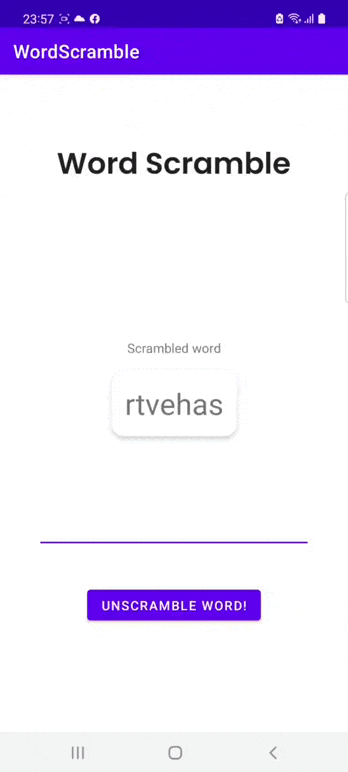

# Лабораторная работа 2. Создание макета, взаимодействие с элементами UI

## Задание 1. Разработать поздравительную открытку с днем рождения.

Открытка должна содержать красивый текст, фоновый цвет и изображения.
Пример открытки

  

## Задание 2. Разработать игру Word Scramble.

Суть игры состоит в следующем:

1. Компьютер выбирает случайное слово из списка слов, перемешивает буквы в этом слове и показывает игроку.
2. Игрок должен догадаться - какое слово выбрал компьютер и ввести его в поле ввода.
3. Если игрок угадал слово - игра начинается заново.
4. Если слово неверное, компьютер сообщает игроку об этом и игра продолжается.
Игра может выглядеть примерно так

  

