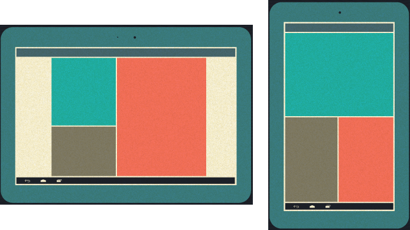
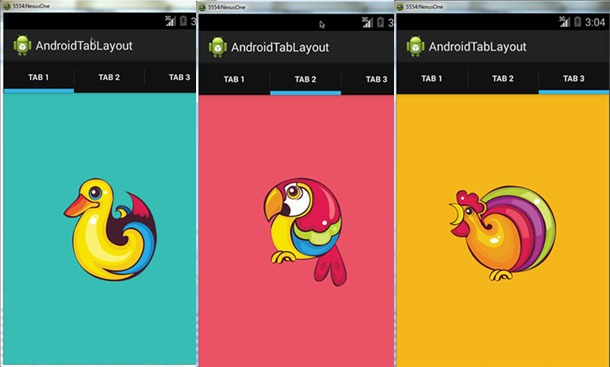

# Лабораторная работа 5. Работа с фрагментами

## Задание 1

С помощью метода статического добавления фрагментов, реализуйте следующее приложение (макет из 4х фрагментов, в зависимости от ориентации используется альтернативный макет с другой компоновкой фрагментов)

  

## Задание 2

С помощью виджетов `ViewPager2` и `TabLayout` (или с помощью виджета `BottomNavigationView`) реализуйте приложение примерно следующего вида (используйте три класса фрагментов)

  

