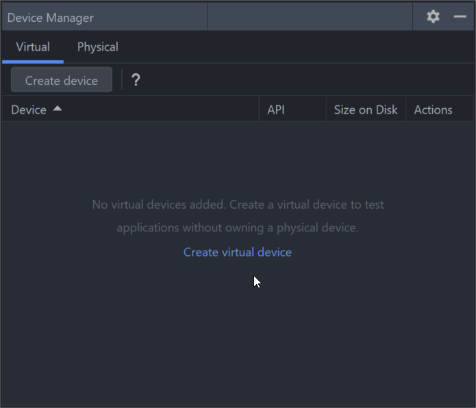
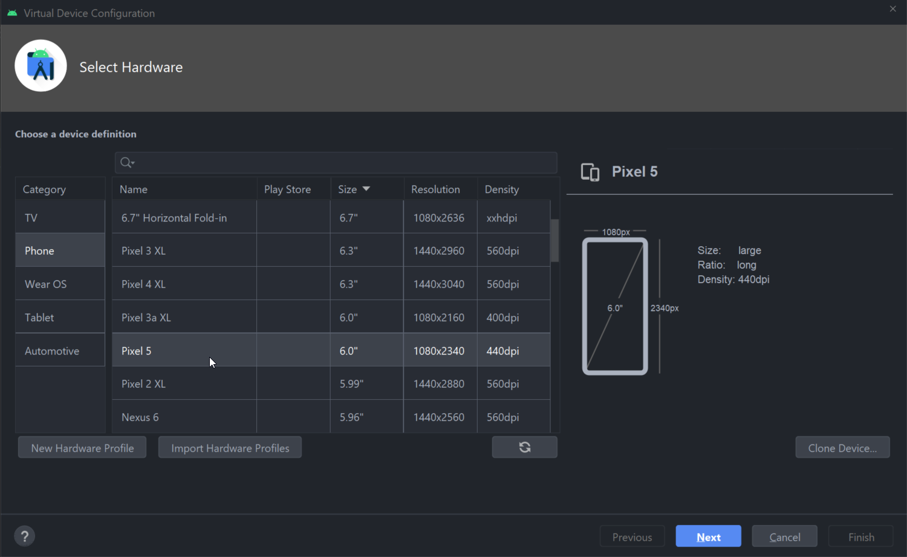
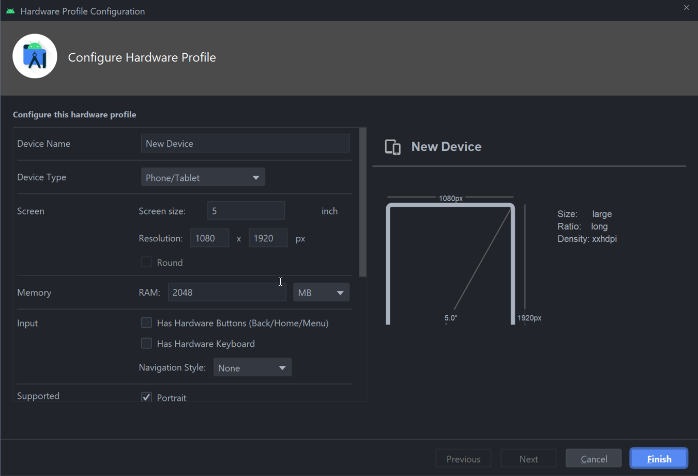
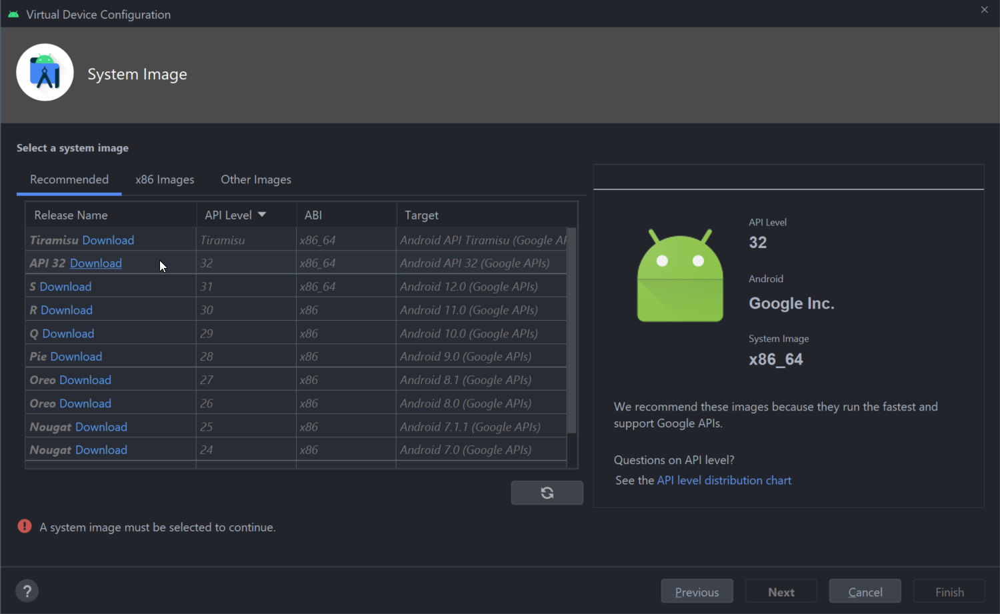
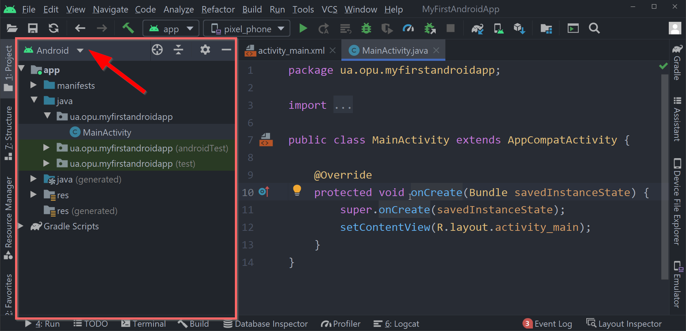
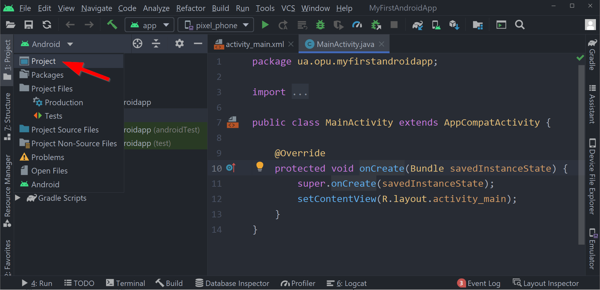
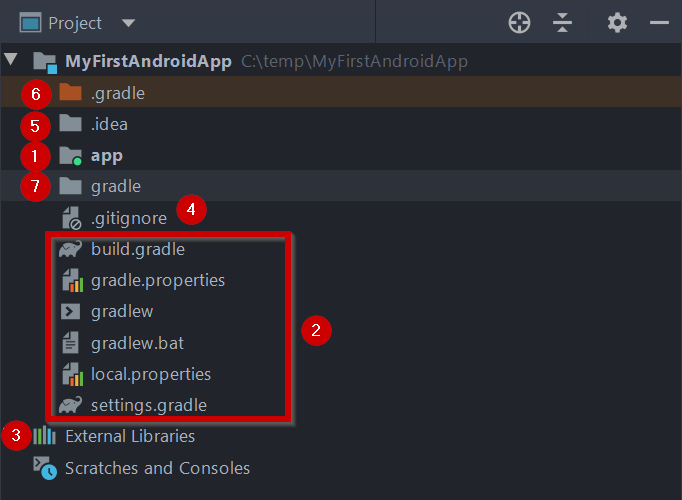
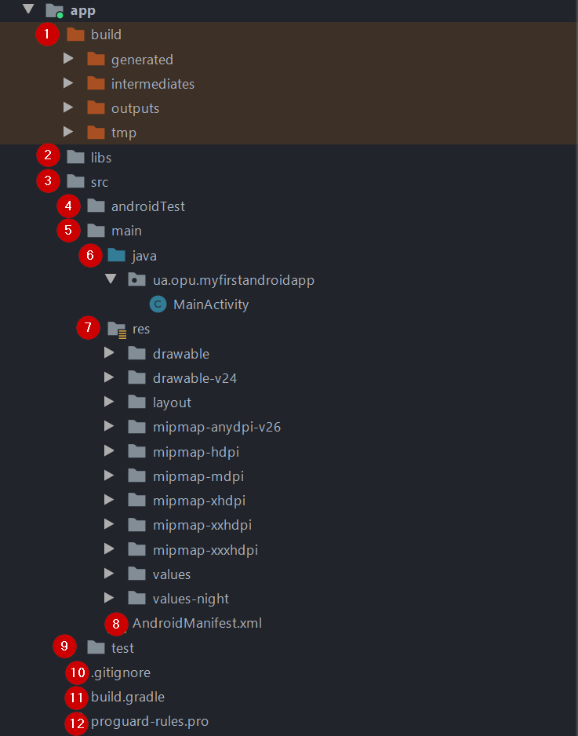

# Знакомство с Android. Установка ПО и создание проекта

## Установка программного обеспечения

Для разработки приложений необходимо установить следующие компоненты:

- Java Development Kit (можете установить актуальную версию);
- специализированную среду разработки Android Studio (https://developer.android.com/studio/);
- Android SDK - набор программ, утилит и библиотек для сборки готового приложения для Android.

Процесс установки JDK стандартный и не требует дополнительных комментариев. Android SDK будет установлен вместе с установкой Android Studio.

Установка Android Studio также довольно проста. При выборе компонент желательно снять выделение с пункта Android Virtual Device - мы его добавим самостоятельно позже.

  

Далее установщик сообщит, что на компьютере отсутствует Android SDK и предложит установить компоненты SDK.

  

Дале необходимо согласиться с лицензионными соглашениями (выбрать пункт Accept справа внизу).

  

Далее установщик загрузит требуемые файлы и теперь мы можем запустить Android Studio.

  

### Требования к процессору и операционной системе

Комфортная разработка мобильных приложений для Android невозможна без использования эмулятора Android устройств. Вы можете использовать сторонние эмуляторы.

Так как работа эмулятора основана на технологии виртуализации, что накладывает ограничения на используемую конфигурацию "процессор + операционная система". Для ускорения эмулятора Android используются следующие технологии виртуализации:

- Microsoft Hyper-V и платформа гипервизора. Hyper-V — это функция виртуализации в Windows, которая позволяет запускать виртуализированные компьютерные системы на физическом главном компьютере;
- Intel Hardware Accelerated Execution Manager (HAXM). HAXM — это механизм виртуализации для компьютеров на базе процессоров Intel.

Для достижения оптимальной производительности рекомендуется использовать Hyper-V для ускорения эмулятора Android. Если Hyper-V недоступен на вашем компьютере, можно использовать HAXM. Эмулятор Android автоматически использует аппаратное ускорение, если соблюдены следующие условия:

- аппаратное ускорение доступно и включено на компьютере разработчика;
- эмулятор работает с образом системы, созданным для виртуального устройства на платформе x86.

Самым предпочтительным вариантом является связка Intel CPU  + Windows 10 Pro и выше. Эмулятор вполне успешно может работать и с AMD процессорами, а также в Linux и macOS, однако, это требует выполнения дополнительных операций.

> Более детальную информацию об эмуляторе, технологиях виртуализации, а также гайд по запуску эмулятора с процессорами AMD, а также с ОС Linux и macOS читайте [здесь](https://android-developers.googleblog.com/2018/07/android-emulator-amd-processor-hyper-v.html), [здесь](https://docs.microsoft.com/ru-ru/xamarin/android/get-started/installation/android-emulator/hardware-acceleration?tabs=vswin&pivots=windows) и [здесь](https://developer.android.com/studio/run/emulator-acceleration).

## Создание и запуск простого проекта

Для того, чтобы изучить основы работы со средой разработки, быстро создадим и запустим пустое приложение.

### Создание проекта с помощью мастера

Создадим новый проект с помощью мастера. В первом окне необходимо выбрать тип устройства, для которого создается проект (в данном случае Phone and Tablet), после чего выбрать тип стартового окна. Выбираем пункт **Empty Activity**

  

Далее мы попадаем в окно настроек проекта, нам необходимо указать название приложения, пакет, выбрать директорию для расположения проекта, язык проекта и минимальную версию Android для запуска приложения.

  

При нажатии на ссылку Help me choose появляется окно с выбором версии, где вы сможете прочитать информацию о фичах, добавленных в этой версии, а также узнать - сколько процентов целевых устройств на Android поддерживают ту или иную версию Android.

*Выбор минимальной версии является открытым вопросом. Часто это зависит от необходимости наличия критических для приложения функций, которые могут отсутствовать в старых версиях Android. Иногда можно найти совет, что ваше приложение должно поддерживать как минимум 90% устройств. Рекомендуется установить версию 21 или новее, так как большинство библиотек перестали поддерживать API 19 и ниже, Google перестал присылать обновления для устройств API 18 и ниже.*

  

Обратите внимание на понятие **API Level**. Если обычный пользователь android-устройств оперирует "версиями Android", то разработчик оперирует версиями API, которые определяют кодовую базу и другие важные для разработчика вещи. В программе и при разработке приложений, всегда оперируйте версиями API.

*Подробную информацию про соотношение версий API и "версий Android" можно найти [здесь](https://apilevels.com) или [здесь](https://developer.android.com/guide/topics/manifest/uses-sdk-element).*

После окончаний работы мастера, Android Studio скачает нужные файлы и плагины, после чего будет получен стартовый проект android-приложения.

Давайте попробуем это запустить, а для этого воспользуемся эмулятором Android.

### Создание и запуск эмулятора для Android

Для запуска приложений можно использовать физические Android-устройства, но это не очень удобно, особенно в процессе добавления нового функционала и отладки.

Для комфортного написания Android-приложений предусмотрен эмулятор различных Android-устройств, который позволяет заранее протестировать работу приложения на различных устройствах самой разнообразной конфигурации.

Для работы с эмуляторами воспользуемся встроенной программой Device Manager, которую можно открыть через меню (Tools -> Device Manager) либо через кнопку на панели справа.

  

Device Manager управляет не только виртуальными, а и физическими устройствами тоже. Создадим новое виртуальное устройство. Для этого нажмем Create virtual device, после чего мы попадаем в окно создания нового устройства.

  

В этом окне можно выбрать тип целевого устройства, а также один из возможных аппаратных профилей (сочетание физических размеров, разрешения экрана, сенсоров и других параметров). При желании вы можете создать свой аппаратный профиль или импортировать существующий.

  

В окне создания аппаратного профиля вы можете выбрать любые сочетания аппаратных параметров устройства - наличие камер, физической клавиатуры, сенсоров, а также физические размеры и разрешение экрана.

После выбора аппаратного профиля, необходимо выбрать версию операционной системы и образа, который будет использоваться в эмуляторе.

  

Лучше выбирать самую свежую стабильную версию операционной системы

### Запуск приложения на физическом устройстве

Чтобы иметь возможность отладки приложения на вашем телефоне или планшете, необходимо выполнить следующие действия:

- включить режим разработчика и разрешить отладку по USB читай здесь;
- скачать драйвера для отладки по USB - читай здесь;
установить драйвера для отладки по USB - читай здесь.

Для отладки, ваше устройство должно быть подключено к компьютеру с помощью USB-кабеля. При попытке запустить ваше приложение, необходимо подтвердить действие на устройстве.

Если вы сделали все корректно, то при запуске приложения у вас в опциях появится ваше подключенное устройство в качестве целевого.

## Структура android-проекта

Вернемся в главное окно Android Studio и рассмотрим составные части проекта, из каких файлов состоит проект и для чего они нужны.

### Дерево проекта

Для начала рассмотрим панель Project в левой части среды разработки.

  

Дерево проекта помогает управлять файлами проекта, а выпадающее меню в верхней части позволяет акцентировать внимание на тех или иных аспектах проекта.

  

### Структура проекта

Для подробного изучения структуры android-проекта, выберем вид Project.

Рассмотрим структуру проекта на верхнем уровне:

  

1. Директория app содержит файлы, которые относятся к отдельному модулю проекта. Модуль - составная автономная часть проекта, в любом проекте должен быть, как минимум, один модуль. При создании проекта, по умолчанию, создается модуль с именем app. Содержимое этой директории мы рассмотрим чуть позже;
2. Набор файлов, которые относятся к сборке нашего проекта с помощью сборщика Gradle. С некоторыми файлами мы будем взаимодействовать походу проекта. Среди всех указанных файлов, нас может интересовать файл build.gradle, который содержит инструкции для сборки проекта в целом;
3. Пункт External Libraries содержит список внешних библиотек, включая библиотеки Java, SDK, а также библиотеки Gradle;
4. Файл .gitignore относится к системе контроля версий Git;
5. Директория .idea содержит файлы, специфичные для среды разработки Android Studio;
6. Директория .gradle содержит исполняемые файлы для сборщика Gradle;
7. Директория gradle содержит скрипт Gradle Wrapper для скачивания и установки нужной версии Gradle.

### Структура директории модуля

Директория модуля является для нас основной, с которой мы будем работать чаще всего.

  

Давайте разберемся, что находится внутри этой директории:

1. Директория `build` содержит файлы, связанные с процессом сборки и тестирования проекта. Как правило, файлы в директории `build` генерируются автоматически и редактировать их не стоит;
2. Если вы хотите добавить сторонние библиотеки вручную, вы можете поместить их в папку `libs`, чтобы они были доступны внутри модуля;
3. Директория `src` содержит набор файлов исходного кода и файлы, которые относятся к "исходникам" проекта (это не только исходный код классов в виде файлов `.java`);
4. Внутри директории `src` находится папка `androidTest`, которая содержит исходники для тестирования приложения на эмуляторе или физическом устройстве;
5. Директория `main` внутри src содержит "основной" набор исходников проекта;
6. Директория `java` содержит исходный код java-классов модуля;
7. Директория `res` содержит набор так называемых **ресурсов** (**resources**), которые не являются исходным кодом, но включаются в ваш проект. К ресурсам, например, относятся изображения, текстовые надписи, аудио и видео файлы и так далее. Тема ресурсов является одной из ключевых, поэтому мы подробно будем разбирать ее позже;
8. Отдельно следует упомянуть **файл манифеста**, который содержит информацию о компонентах приложения и нужна для корректной работы ОС с вашим приложением;
9. Директория `test` содержит код для тестирования кода на вашем компьютере, в рамках работы JVM;
10. Файл `.gitignore` относится к системе контроля версий Git;
11. Файл `build.gradle` содержит инструкции для сборки этого модуля;
12. Файл `proguard-rules.pro` используется для технологии [ProGuard](https://www.guardsquare.com/en/products/proguard), которая позволяет оптимизировать байт-код приложения, уменьшить объем приложения, увеличить скорость работы приложения, а также повысить уровень безопасности с помощью обфускации кода.
