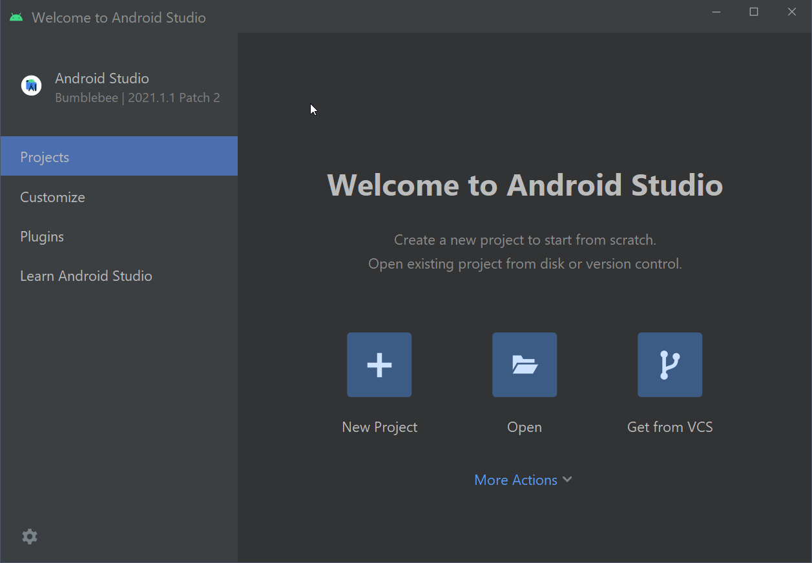

## Установка и настройка требуемого ПО

### 1. Установка программного обеспечения

Для разработки приложений необходимо установить следующие компоненты:

- Java Development Kit (можете установить актуальную версию);
- специализированную среду разработки Android Studio (https://developer.android.com/studio/);
- Android SDK - набор программ, утилит и библиотек для сборки готового приложения для Android.

Процесс установки JDK стандартный и не требует дополнительных комментариев. Android SDK будет установлен вместе с установкой Android Studio.

Установка Android Studio также довольно проста. При выборе компонент желательно снять выделение с пункта Android Virtual Device - мы его добавим самостоятельно позже.

  

Далее установщик сообщит, что на компьютере отсутствует Android SDK и предложит установить компоненты SDK.

  

Дале необходимо согласиться с лицензионными соглашениями (выбрать пункт Accept справа внизу).

  

Далее установщик загрузит требуемые файлы и теперь мы можем запустить Android Studio.

  

### 2. Требования к процессору и операционной системе

Комфортная разработка мобильных приложений для Android невозможна без использования эмулятора Android устройств. Вы можете использовать сторонние эмуляторы.

Так как работа эмулятора основана на технологии виртуализации, что накладывает ограничения на используемую конфигурацию "процессор + операционная система". Для ускорения эмулятора Android используются следующие технологии виртуализации:

- Microsoft Hyper-V и платформа гипервизора. Hyper-V — это функция виртуализации в Windows, которая позволяет запускать виртуализированные компьютерные системы на физическом главном компьютере;
- Intel Hardware Accelerated Execution Manager (HAXM). HAXM — это механизм виртуализации для компьютеров на базе процессоров Intel.

Для достижения оптимальной производительности рекомендуется использовать Hyper-V для ускорения эмулятора Android. Если Hyper-V недоступен на вашем компьютере, можно использовать HAXM. Эмулятор Android автоматически использует аппаратное ускорение, если соблюдены следующие условия:

- аппаратное ускорение доступно и включено на компьютере разработчика;
- эмулятор работает с образом системы, созданным для виртуального устройства на платформе x86.

Самым предпочтительным вариантом является связка Intel CPU  + Windows 10 Pro и выше. Эмулятор вполне успешно может работать и с AMD процессорами, а также в Linux и macOS, однако, это требует выполнения дополнительных операций.

> Более детальную информацию об эмуляторе, технологиях виртуализации, а также гайд по запуску эмулятора с процессорами AMD, а также с ОС Linux и macOS читайте [здесь](https://android-developers.googleblog.com/2018/07/android-emulator-amd-processor-hyper-v.html), [здесь](https://docs.microsoft.com/ru-ru/xamarin/android/get-started/installation/android-emulator/hardware-acceleration?tabs=vswin&pivots=windows) и [здесь](https://developer.android.com/studio/run/emulator-acceleration).

## Создание и запуск простого проекта

Для того, чтобы изучить основы работы со средой разработки, быстро создадим и запустим пустое приложение.

### Создание проекта с помощью мастера

Создадим новый проект с помощью мастера. В первом окне необходимо выбрать тип устройства, для которого создается проект (в данном случае Phone and Tablet), после чего выбрать тип стартового окна. Выбираем пункт **Empty Activity**

  

Далее мы попадаем в окно настроек проекта, нам необходимо указать название приложения, пакет, выбрать директорию для расположения проекта, язык проекта и минимальную версию Android для запуска приложения.

  

При нажатии на ссылку Help me choose появляется окно с выбором версии, где вы сможете прочитать информацию о фичах, добавленных в этой версии, а также узнать - сколько процентов целевых устройств на Android поддерживают ту или иную версию Android.

Выбор минимальной версии является открытым вопросом. Часто это зависит от необходимости наличия критических для приложения функций, которые могут отсутствовать в старых версиях Android. Иногда можно найти совет, что ваше приложение должно поддерживать как минимум 90% устройств. Рекомендуется установить версию 21 или новее, так как большинство библиотек перестали поддерживать API 19 и ниже, Google перестал присылать обновления для устройств API 18 и ниже.

  

