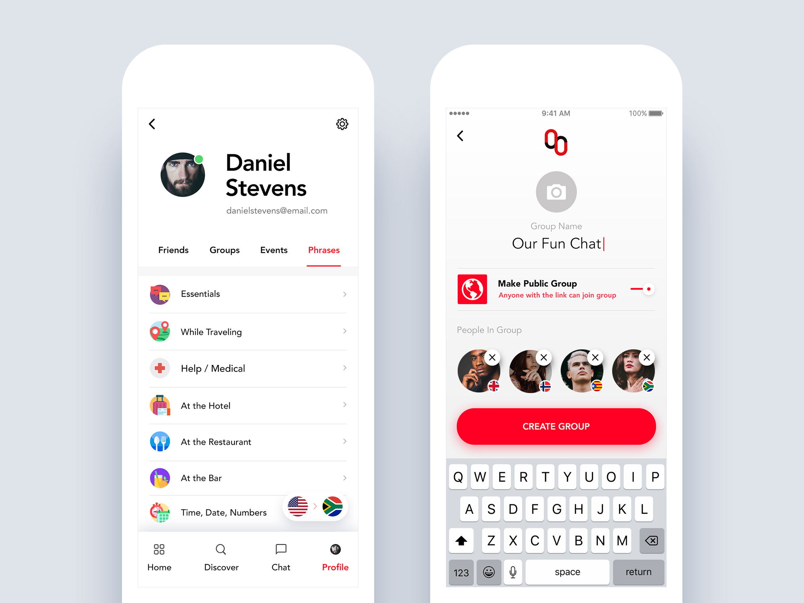
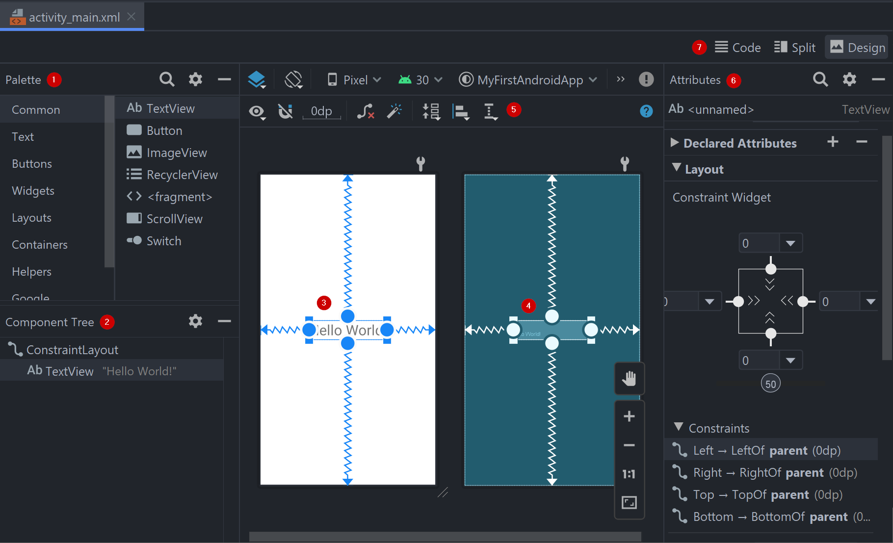
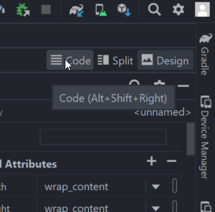
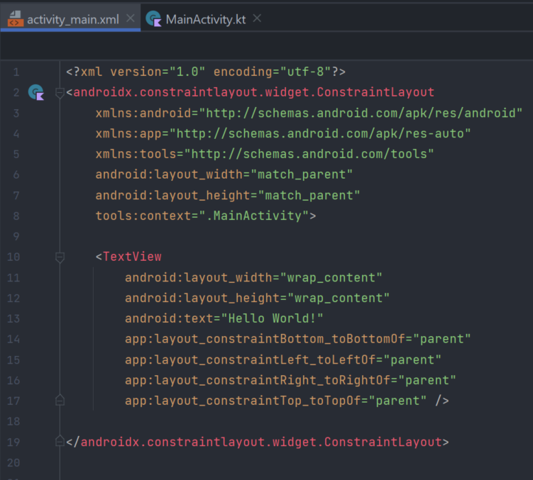
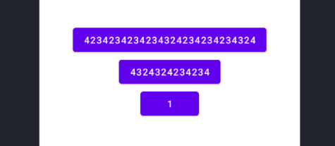

# Activity и макеты

Изучение Android начнем с создания простейшего приложения. Вернемся в главное окно, в панели Project выберем представление Android и подробнее разберемся в тех файлах, которые есть в нашем проекте.

Прежде всего, нас интересуют два файла - `MainActivity.kt` и `activity_main.xml`, которые описывают и программируют стартовое Activity нашего приложения, которое было добавлено мастером создания нового проекта.

Базовым "строительным блоком" пользовательского интерфейса является **Acitivty** (активити, активность, операция). В первом приближении вы можете воспринимать Activity как аналог окна в десктопном приложении или страницы в классическом веб-приложении. Activity представляет пользовательский интерфейс и, во многих случаях, точку входа в ваше приложение.

## Определение Activity

**Activity** — это компонент приложения, который представляет собой экран с пользовательским интерфейсом и функционалом, и с которым пользователи могут взаимодействовать для выполнения каких-либо действий, например набрать номер телефона, сделать фото, отправить письмо или просмотреть карту.

Каждой Activity соответствует окно для прорисовки соответствующего пользовательского интерфейса. Обычно окно отображается во весь экран, однако его размер может быть меньше, и оно может размещаться поверх других окон (в последнее время стало распространена технология split-screen, когда приложение занимает только часть экрана, а также ваше приложение может быть запущено в режиме multi-window на устройстве ChromeOS и подобных ему).

Количество Activity в приложении может быть один или больше. Activity, которая запускается первой, считается стартовой. Из нее можно запустить другую Activity этого же приложения, а также Activity других приложений.

Подробное описание Activity можете прочесть [здесь](https://developer.android.com/guide/components/activities/intro-activities?hl=ru).

### Контроллер Activity

На данном этапе будем считать, что Activity - это отдельный экран приложения. Экран должен содержать интерфейс для взаимодействия пользователя с экраном, а также класс контроллера экрана, который содержит бизнес-логику связанную с экраном.

В нашем проекте, по умолчанию, уже есть один стартовый экран, который вы могли видеть при запуске пустого Android-проекта.
Класс контроллера нашего стартового окна находится в директории `src\main\java\<название пакета>\MainActivity.kt`.

Рассмотрим содержимое класса подробнее.

```kotlin
class MainActivity : AppCompatActivity() {
    override fun onCreate(savedInstanceState: Bundle?) {
        super.onCreate(savedInstanceState)
        setContentView(R.layout.activity_main)
    }
}
```

Обратите внимание, что класс контроллера наследуется от класса `AppCompatActivity`. Этот класс входит в набор библиотек `AndroidX` и предназначен для обеспечения обратной совместимости `Activity` на старых версиях операционной системы.

Схема работы механизма наследования стандартна для объектно-ориентированных языков: в суперклассах определены методы, которые отвечают за стандартное поведение класса `Activity`. Если мы хотим изменить поведение контроллера, мы переопределяем нужные методы.

В данном случае мы переопределяем метод `onCreate()`. Этот метод является callback-методом и вызывается в момент, когда операционная система создает объект класса `Activity`.

Первым действием мы вызываем метод onCreate() суперкласса (при создании объекта `Activity` должны быть выполнены определенные служебные действия, которые определены в методах `onCreate()` в цепочке наследования), после чего мы можем программировать необходимое поведение класса `Activity` при создании объекта.

Обратите внимание на строку `setContentView(R.layout.activity_main)`

В данной строке мы вызываем метод `setContentView()` и передаем ему ссылку на ресурс макета окна. Поговорим о нем подробнее.

### Создание макета для Activity

Для построения пользовательского интерфейса в Android используются файлы макета в формате `xml`. Файлы макетов относятся к ресурсам и находятся в папке `res\layout`.

Построение пользовательского интерфейса в Android основано на контролах (или виджетах) и контейнерах. Виджет представляет собой элемент UI, который отображает изменяемую информацию, например, окно или текстовое поле. Виджеты являются базовыми визуальными строительными блоками, сочетание и параметры которых определяет внешний вид приложения и порядок взаимодействия с приложением.

<p align="center">
  
</p>

На примере UI выше мы можем заметить текстовые надписи, изображения, списки с информацией, меню в нижней части экрана, поля ввода и так далее. Параметры, сочетания и расположение этих элементов определяет то, как пользователь потребляет информацию и взаимодействует с приложением.

Вы можете использовать стандартные виджеты, подключать виджеты сторонних разработчиков, а также создавать свои собственные.

Контейнеры позволяют организовывать и располагать виджеты определенным образом. В контейнеры можно помещать виджеты, а также другие контейнеры. Каждый тип контейнера имеет свою логику организации элементов, а также свои параметры настройки.

**С учетом многообразия форм, размеров и параметров android-устройств, абсолютное позиционирование элементов UI является категорически неприемлемым. При создании макета, всегда, где это возможно, старайтесь избегать указания конкретных значений, особенно, это касается размеров элементов.**

В созданном мастером проекте у нас изначально есть один класс Activity под названием `MainActivity` и макет под названием `activity_main.xml`. Обратите внимание, как эти названия соотносятся между собой, старайтесь называть макеты таким же образом.

Откроем файл `activity_main.xml` и посмотрим его содержимое.

#### Редактор макетов

Для работы с макетами в Android Studio встроен многофункциональный **редактор макетов** (**Layout Editor**), который позволит вам удобно конструировать самые разнообразные макеты пользовательского интерфейса.

<p align="center">
  
</p>

Рассмотрим основные рабочие панели редактора макетов:

1. **область с «виджетами»** – элементами пользовательского интерфейса;
2. **дерево компонентов** – позволяет легко выбирать элементы и наглядно увидеть иерархию объектов в разметке;
3. **визуальное представление** – так элементы будут выглядеть на экране устройства;
4. **чертеж (Blueprint view)** – специальный вид, который позволяет легко увидеть взаимоотношения и наложения элементов, позволяет выделять невидимые элементы и так далее;
5. **панель с инструментами** - позволяет изменить размер и тип устройства, язык, версию API, а также содержит другие инструменты;
6. **панель со свойствами** - позволяет изменять свойства выделенного виджета. Изначально представлены основные свойства выделенного элемента, по ссылке внизу можно перейти к отображению всех свойств элемента;
7. **выбор представления макета** - в виде xml-кода, визуально или в совмещенном виде.

**Подробно возможности и работу редактора макетов читайте [здесь](https://developer.android.com/studio/write/layout-editor)**

#### Построение пользовательского интерфейса. Менеджер `ConstraintLayout`

Принцип построения пользовательского интерфейса мало чем отличается от стандартов построения GUI, которые вы могли наблюдать при использовании различных инструментов построения пользовательского интерфейса - у нас есть обычные виджеты, виджеты - контейнеры, а также менеджеры разметок (Layouts), которые размещают элементы согласно той или иной логике.

На данный момент стандартный менеджером разметки является менеджер `ConstraintLayout`, который организует элементы с помощью системы привязок к другим элементам, направляющим, барьерам а также к сторонам экрана.

**Отличную подробную статью на русском языке про работу менеджера `ConstraintLayout` вы можете прочитать [здесь](https://startandroid.ru/ru/uroki/vse-uroki-spiskom/489-urok-180-constraintlayout-osnovy.html).
Исчерпывающую англоязычную документацию от разработчиков Android можно найти [здесь](https://developer.android.com/training/constraint-layout/) и [здесь](https://developer.android.com/reference/android/support/constraint/ConstraintLayout).
Дополнительные неплохие статьи (информация может пересекаться с предыдущими источниками) на русском языке читайте [здесь](https://habr.com/ru/company/touchinstinct/blog/326814/) и [здесь](http://developer.alexanderklimov.ru/android/layout/constraintlayout.php).**

Если у вас пока что не получается совладать с менеджером разметки, перейдите в текстовый вид макета (вкладка **Code** внизу слева в редакторе).

<p align="center">
  
</p>

Макет представляет собой файл в формате XML.

<p align="center">
  
</p>

##### Структура XML-доукмента

XML-документ формируется как дерево **элементов** (**element**). Дерево начинается с корневого элемента (root element), внутри которого помещаются дочерние элементы, которые, в свою очередь, могут иметь свои дочерние элементы и так далее.

```html
<root>
  <child>
    <subchild>.....</subchild>
  </child>
</root>
```

**Все элементы должны иметь закрывающий тег**

Если элемент не предполагает дочерних элементов, то открывающий тег может сразу быть закрывающим

```html
<element />
```

Элемент может содержать атрибуты в виде пар ключ = значение. Название атрибута является ключом, значение атрибута является значением. Значение атрибута всегда пишется в кавычках.

```html
<element attr1="value1" attr2="value2" />
```

Так как xml-элемент в макетах, как правило, содержит много атрибутов, то их удобно записывать с новой строки. В таком случае, элемент будет иметь следующий вид

```html
<element 
    attr1="value1" 
    attr2="value2" />
```

#### Создание макета Activity

Давайте детально разберем макет `activity_main.xml`

Первая строка 

`<?xml version="1.0" encoding="utf-8"?>`

называется XML declaration line и содержит инструкции для обработчика, которые позволяют корректно распарсить XML-документ. Для версии XML 1.0 эта строка опциональна, но крайне желательно её не убирать. В данном случае в инструкции содержится информация о том, что в документе используется XML-версия 1.0 и кодировка utf-8.

Далее идет корневой элемент под названием `androidx.constraintlayout.widget.ConstraintLayout`. Название элемента является полным именем класса, который соответствует этому элементу. На этапе построения UI, каждый элемент будет распарсен и на его основе будет создан объект соответствующего класса, который указан в названии элемента.

Обратите внимание, что в случае с виджетом `ConstraintLayout`, мы указываем полное имя класса, включая все пакеты, а в случае с виджетом `TextView` мы указываем только имя класса. Это связано с тем, что `ConstraintLayout` находится в сторонней библиотеке `androidx`, тогда как `TextView` является частью пакета `android.view`, который поставляется вместе с операционной системой.

Далее, рассмотрим некоторые атрибуты элемента `ConstraintLayout`

```xml
<androidx.constraintlayout.widget.ConstraintLayout
    xmlns:android="http://schemas.android.com/apk/res/android"
    xmlns:app="http://schemas.android.com/apk/res-auto"
    xmlns:tools="http://schemas.android.com/tools"
    ...
    >
```

Атрибуты xmlns используются для задания пространства имен. Пространства имен используются, чтобы не возник конфликт атрибутов с одинаковым названием внутри XML-документа. Название атрибута `xmlns:android` означает задание пространства имен под названием `android`, а значение `http://schemas.android.com/apk/res/android` - это просто уникальная строка, которая отделяет одно пространство имен от другого. Это не ссылка на сайт, с таким же успехом значение могло быть просто `12345`, главное - его уникальность. Пространства имен, заданные в корневом элементе, распространяются на все дочерние элементы документа.

##### Константы match_parent и wrap_content

Атрибуты 

```xml
<androidx.constraintlayout.widget.ConstraintLayout
    ...
    android:layout_width="match_parent"
    android:layout_height="match_parent"
    ...
```

задают ширину и высоту элемента. При разработке UI желательно не задавать точные размеры элементов, так как на разных устройствах виджеты будут иметь разные физические размеры и весь макет может некорректно отображаться.

Константы `match_parent` и `wrap_content` позволяют отчасти решить эту проблему.

Указание ширины и\или высоты как `match_parent` означает, что виджет будет стремиться занять всё пространство внутри родительского виджета по ширине и\или высоте соответственно.

Константа wrap_content означает, что компонент будет стремиться занять настолько малые размеры по ширине и\или высоте, чтобы вместить в себя своё содержимое.

Для примера, вот как будут выглядеть кнопка с указанием `match_parent` по ширине

<p align="center">
  
</p>

А вот как будут выглядеть кнопки с указанием `wrap_content` по ширине

<p align="center">
  
</p>

Следует обратить внимание, что виджет кнопки имеет параметр минимальной ширины, поэтому кнопка не стала очень маленькой.

В данном случае, `ConstraintLayout` является корневым элементом макета, поэтому он займет на экране всё пространство, отведенное под пользовательские виджеты.

Внутри макета `ConstraintLayout` определена текстовая надпись - виджет `TextView`.

```xml
<TextView
    android:layout_width="wrap_content"
    android:layout_height="wrap_content"
    android:text="Hello World!"
    app:layout_constraintBottom_toBottomOf="parent"
    app:layout_constraintLeft_toLeftOf="parent"
    app:layout_constraintRight_toRightOf="parent"
    app:layout_constraintTop_toTopOf="parent" />
```

Атрибут `text` определяет надпись на кнопке, а четыре атрибута `app:` определяют привязки элемента к родительскому виджету.

##### Еще немного про пространства имен

Давайте разберемся, почему в данном макете используются аж целых три пространства имен и чем они отличаются?

Пространство имен android описывает стандартные атрибуты, которые входят в набор библиотек, которые поставляются вместо с операционной системой Android. То есть, такое пространство описывает "стандартные" атрибуты

Пространство имен `app` описывает атрибуты, которые поставляются со сторонними библиотеками для android. Суффикс `res-auto` в значении атрибута `xmlns:app` означает, что во время сборки проекта туда будет подставлен пакет проекта. В нашем случае, атрибуты `app:` связаны с виджетом `ConstraintLayout`, который поставляется в стороннем пакете из набора пакетов `androidx`.

Также, атрибуты с пространством имен `app` правильно работают на старых версиях `android`, потому что набор пакетов `androidx` также призван обеспечить обратную совместимость.

Пространство имеет `tools` описывает атрибуты, которые нужны на этапе разработки программы, они не попадут в финальную сборку приложения.

В данном случае атрибут

```xml
<androidx.constraintlayout.widget.ConstraintLayout
    ...
    tools:context=".MainActivity">
```

указывает на связанное с этим макетом Activity для нужд редактора макетов.

### Работа с объектами UI в Activity

Согласно принципу разделения обязанностей, а также семейству архитектурных паттернов MV*, работа с объектами UI, а также обработка событий должна происходить в классе контроллера, то есть, в нашем случае в классе `MainActivity.java`.

Если вы работали с библиотеками GUI, которые имеют механизмы генерации дерева UI из декларативного описания интерфейса, то вы должны понимать, что должен быть предоставлен механизм получения ссылок на объекты UI. Система Android, в данном случае, не является исключением - объекты UI создаются объектом `LayoutInflater` во время работа метода `setContentView()`. Как же нам получить ссылки на объекты UI?

По мере развития платформы Android, разработчики предлагали разные способы, каким образом можно получить в исходном коде Activity ссылку на объект UI.

На данный момент разработчики предлагают использовать две технологии - View Binding и Data Binding.

В рамках данного курса будет показана работа с технологией View Binding. По ссылке [здесь](https://developer.android.com/topic/libraries/view-binding#data-binding) предоставлена информация об отличии одной технологии от другой.

Для того, чтобы "включить" возможность использовать технологию View Binding, необходимо открыть файл build.gradle для модуля, в котором вы хотите включить технологию, после чего прописать строку 

```groovy
buildFeatures {
    viewBinding = true
}
```

Таким образом, файл build.gradle для модуля будет выглядеть следующим образом

```groovy
plugins {
    id 'com.android.application'
    id 'org.jetbrains.kotlin.android'
}

android {
   
    ...

    defaultConfig {
    ...
    }

    buildTypes {
    ...
    }
    compileOptions {
    ...
    }
    kotlinOptions {
    ...
    }

    buildFeatures {
        viewBinding = true
    }
}

dependencies {
    ...
}
```

после чего синхронизировать файл (нажать sync now в плашке вверху).

Теперь вернемся в класс `MainActivity`. Здесь необходимо убрать строку с вызовом метода `setContentView()`. После чего прописать следующий код

```kotlin
class MainActivity : AppCompatActivity() {

    override fun onCreate(savedInstanceState: Bundle?) {
        super.onCreate(savedInstanceState)

        val binding = ActivityMainBinding.inflate(layoutInflater)
        setContentView(binding.root)
    }
}
```

Давайте попробуем разобраться в этом коде

Для каждого XML-макета в модуле генерируется свой класс привязки. Этот класс хранит ссылки на корневой элемент макета, а также на остальные элементы макета, для которых в макете прописан `id`. Имя класса привязки генерируется исходя из названия файла макета с суффиксом "Binding".

Для того, чтобы создать объект этого класса, мы вызываем статический метод `inflate()` и передаем ему объект `layoutInflater`, который находится в составе `Activity`. В результате работы метода `inflate` мы получаем ссылку на объект класса привязки.

Далее мы вызываем метод активити `setContentView()`, которому передаем ссылку на корневой элемент созданного дерева UI-элементов, чтобы он его "прикрепил" к дереву элементов всего окна.

Давайте добавим