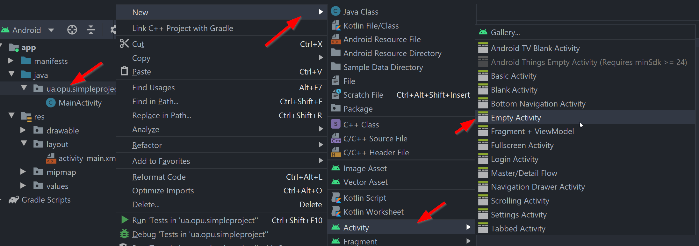
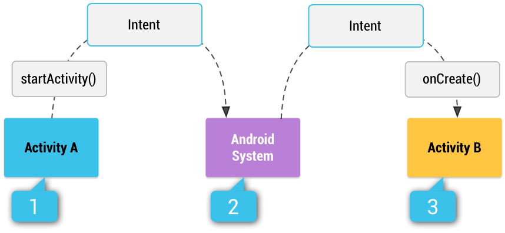
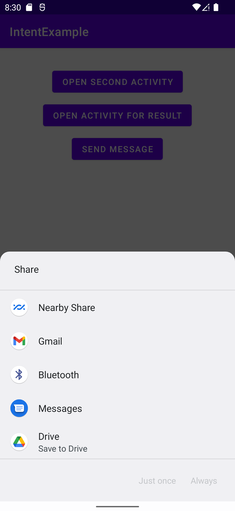
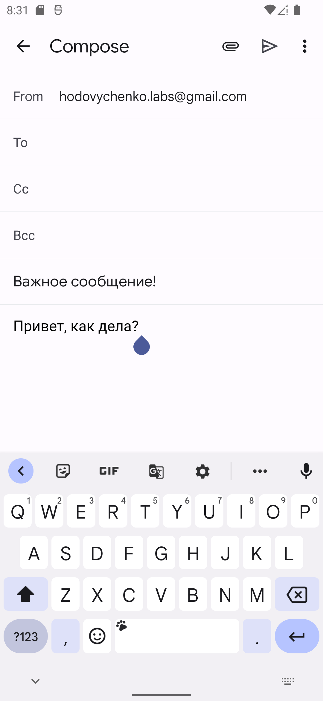
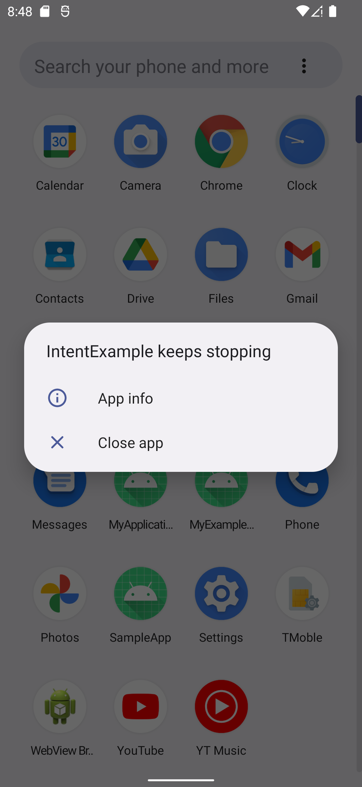
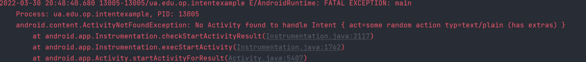
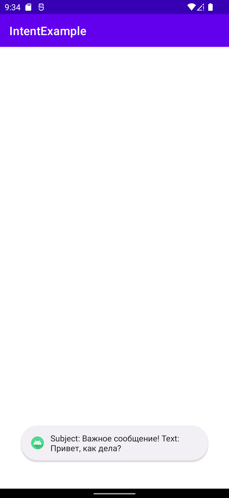

# Создание Activity. Манифест приложения

Разработаем небольшое приложение, которое состоит из двух Activity. Для этого нам необходимо научиться добавлять в проект еще одно окно приложения.

Окно можно добавить с помощью мастера или вручную.

### Добавление Activity с помощью мастера

Чтобы добавить Activity с помощью мастера выберите пункт New -> Activity, после чего выберите нужный тип Activity (выбрать пункт New можно нажав правой кнопкой мыши в папке проекта или из меню File).

<p align="center">
  
</p>

### Добавление Activity вручную

Для начала создадим класс еще одного Activity, назовем его SecondActivity.kt.

Создадим новый класс, который наследуется от AppCompatActivity, после чего переопределим метод onCreate().

```kotlin
class SecondActivity : AppCompatActivity() {
    override fun onCreate(savedInstanceState: Bundle?) {
        super.onCreate(savedInstanceState)

        setContentView(R.layout.activity_second)
    }
}
```

Далее создадим ресурс макета и назовем его activity_second.

**Имя файла макета принято выбирать созвучным названию класса контроллера, для которого этот макет создается. В нашем случае, для класса SecondActivity создается макет с названием activity_second. Для класса MainActivity был сгенерирован макет с именем activity_main**

Чтобы закончить процесс создания второго окна приложения, нам необходимо поговорить о такой важной составляющей Android-приложения как файл манифеста.

### Манифест приложения

Манифест приложения содержится в файле AndroidManifest.xml. Файл манифеста содержит важную информацию о приложении, которая требуется системе Android. Только получив эту информацию, система может выполнить какой-либо код приложения.

В этом файле описываются основные параметры и компоненты приложения. В процессе разработки приложения вы будете постоянно редактировать данный файл, изменяя его структуру и дополняя новыми элементами и атрибутами.

Каждый проект приложения должен иметь файл манифеста в корне директории с исходными кодами проекта.

**Подробная информация о манифесте приложения - [здесь](https://developer.android.com/guide/topics/manifest/manifest-intro?hl=ru)**

На этом этапе нам важно знать, что все Activity должны быть указаны в файле манифеста. Также в файле манифеста указывается стартовое Activity.

Откроем файл манифеста (он находится в директории manifests) и рассмотрим его структуру

```xml
<?xml version="1.0" encoding="utf-8"?>
<manifest xmlns:android="http://schemas.android.com/apk/res/android"
    package="ua.edu.op.intentexample">

    <application
        android:allowBackup="true"
        android:icon="@mipmap/ic_launcher"
        android:label="@string/app_name"
        android:roundIcon="@mipmap/ic_launcher_round"
        android:supportsRtl="true"
        android:theme="@style/Theme.IntentExample">
        <activity
            android:name=".ThirdActivity"
            android:exported="false" />
        <activity
            android:name=".MainActivity"
            android:exported="true">
            <intent-filter>
                <action android:name="android.intent.action.MAIN" />
                <category android:name="android.intent.category.LAUNCHER" />
            </intent-filter>
        </activity>
    </application>
</manifest>
```

Нас интересует элемент `<application>`, который описывает информацию о приложении и его отдельных компонентах.

Внутри элемента `<application>` должны быть объявлены основные компоненты приложения, в частности, все Activity приложения. Структура файла манифеста в нашем случае будет выглядеть так

```xml
<manifest>
    ...
    <application>
        ...
        <activity>...</activity>
        <activity>...</activity>
        <activity>...</activity>
        <activity>...</activity>
        ...
     </application>
     ...
</manifest>
```

Для того, чтобы мы могли открыть новое окно, нам необходимо зарегистрировать новое activity в манифесте приложения. Отредактируем файл манифеста и добавим элемент activity, в атрибуте name укажем название класса activity.

Файл манифеста будет выглядеть следующим образом

```xml
<?xml version="1.0" encoding="utf-8"?>
<manifest xmlns:android="http://schemas.android.com/apk/res/android"
    package="ua.edu.op.intentexample">

    <application
        android:allowBackup="true"
        android:icon="@mipmap/ic_launcher"
        android:label="@string/app_name"
        android:roundIcon="@mipmap/ic_launcher_round"
        android:supportsRtl="true"
        android:theme="@style/Theme.IntentExample">
        <activity
            android:name=".ThirdActivity"
            android:exported="false" />
        <activity
            android:name=".MainActivity"
            android:exported="true">
            <intent-filter>
                <action android:name="android.intent.action.MAIN" />
                <category android:name="android.intent.category.LAUNCHER" />
            </intent-filter>
        </activity>
        <!-- Зарегистрировали еще одно activity-->
        <activity android:name=".SecondActivity" />
    </application>
</manifest>
```

## Механизм намерений

Так как Activity относится к основным компонентам приложения а также является контекстом (что это, мы разберем позже), для открытия окна мы не можем просто создать объект-наследник AppCompatActivity и вызвать метод для отображения окна на экране устройства, мы должны запрашивать это действие у операционной системы.
Для того, чтобы сделать запрос на открытие окна, мы должны сформировать объект сообщения
Для того, чтобы запустить любой другой экземпляр Activity, необходимо вызвать метод startActivity(Intent intent) любого экземпляра Context (класс Activity наследует Context, поэтому он связан с ним отношением is a - экземпляр Activity является экземпляром Context). Экземпляр Intent, в свою очередь, требует передать экземпляр Context в первом параметре и ссылку на запускаемый класс Activity:

Для открытия окна мы должны воспользоваться механизмом намерений (Intent).
Intent - это механизм для описания одной операции, а также способ обмена сообщениями между компонентами приложения.

### Типы объектов Intent

Существуют явные и неявные объекты Intent:

- явные намерения - указывают компонент, который требуется запустить, по имени (указывается полное имя класса). Явные намерения обычно используются для запуска компонент из собственного приложения, так как известно имя класса Acitvity или службы, которую необходимо запустить;
- неявные намерения - не содержат имени конкретного компонента. Вместо этого они в целом объявляют действие, которое требуется выполнить, что дает возможность компоненту из другого приложения обработать запрос. Например, если требуется указать пользователю место на карте, то с помощью неявного объекта Intent можно запросить, чтобы это сделало другое приложение, в котором такая возможность предусмотрена.

Схематичная работа механизма неявных намерений представлена на изображении ниже

<p align="center" style="background-color:white">
  
</p>

1. Activity А создает объект Intent с описанием действия и передает его методу startActivity();
2. Система Android ищет во всех приложениях фильтры Intent, которые соответствуют данному объекту Intent. Когда приложение с подходящим фильтром найдено;
3. Система запускает соответствующую операцию (Activity B), вызвав ее метод onCreate() и передав ему объект Intent.

**Более подробно читайте про механизм намерений [здесь](https://developer.android.com/guide/components/intents-filters?hl=ru) и [здесь](http://developer.alexanderklimov.ru/android/theory/intent.php)**

#### Использование явных намерений

Для запуска нового Activity необходимо использовать явные намерения. Создадим объект типа Intent, укажем полное имя класса компонента (в данном случае Activity), другие параметры (если требуется) и передадим объект методу Context.startActivity(). Далее операционная система запустит компонент, который указан в объекте Intent.

Добавим в макет MainActivity кнопку и напишем слушатель, который будет запускать новое Activity по нажатию на эту кнопку

```kotlin
class MainActivity : AppCompatActivity() {
    override fun onCreate(savedInstanceState: Bundle?) {
        super.onCreate(savedInstanceState)

        val binding = ActivityMainBinding.inflate(layoutInflater)
        setContentView(binding.root)

        binding.btnFirst.setOnClickListener {
            startActivity(Intent(this, SecondActivity::class.java))
        }
    }
}
```

#### Передача данных между Activity

Важно понимать, что созданием, инициализацией и настройкой экземпляров Activity, которые вы покажете своему пользователю, будет заниматься система - их нельзя создать с помощью ключевого слова new, настроить или иным образом изменить при запуске. Мы передаем системе экземпляр Intent, который определяет, какой класс Activity мы хотим использовать, а система делает все остальное. По этой причине нет никакой возможности изменять свойства и вызывать методы экземпляра Activity непосредственно во время запуска.
Но коль скоро нельзя изменять свойства и вызывать методы экземпляра Activity непосредственно в процессе запуска, как тогда передать ему информацию?

В Android ваши возможности весьма ограничены. Классический подход заключался в привязке простых значений к объекту Intent с помощью механизма Extras, например так:

```kotlin
binding.btnFirst.setOnClickListener {
    val i = Intent(this, SecondActivity::class.java)
    i.putExtra("some_id", 10)
    startActivity(i)
}
```

Экземпляр Intent, запустивший Activity, доступен через свойство intent

```kotlin
class SecondActivity : AppCompatActivity() {

    override fun onCreate(savedInstanceState: Bundle?) {
        super.onCreate(savedInstanceState)
        setContentView(R.layout.second_activity)
        
        val value = intent.getIntExtra("some_id", 0)
    }
}
```

Обратите внимание, что вторым параметром в метод getIntExtra() передается значение по умолчанию. Оно будет использовано, если значение с таким ключом не будет найдено.

В 2020 году разработчики Android предложили механизм Activity Result API, который упрощает процедуру обмена данными между Activity. Его использование мы рассмотрим ниже.

#### Использование неявных намерений

Представим, что мы хотим выслать некоторую информацию с помощью электронной почты. Создадим проект с одним Activity и кнопкой, по нажатию на которую должно открыться приложение для отправки электронной почты. Напишем обработчик нажатия на кнопку

```kotlin
binding.btnThird.setOnClickListener {
    val i = Intent(Intent.ACTION_SEND)
    i.type = "text/plain"
    i.putExtra(Intent.EXTRA_SUBJECT, "Важное сообщение!")
    i.putExtra(Intent.EXTRA_TEXT, "Привет, как дела?")

    startActivity(i)
}
```

Действие, которое мы хотим совершить, является обычной текстовой строкой. Набор стандартных действий содержится в классе Intent в виде набора статических констант. В этом же классе есть статические константы для указания дополнительных параметров действия. В нашем случае, это тема письма и содержимое сообщения. Метод setType() устанавливает MIME-тип сообщения.
После указания параметров сообщения, мы вызываем метод startActivity(), операционная система выбирает нужное Activity из списка всех Activity приложений, которые установлены на данном устройстве. Таким образом, с помощью неявного намерения мы можем открыть Activity другого приложения.
Запустим приложение в эмуляторе и нажмем на кнопку.

<p align="center" style="max-width:40%">
  
</p>

<p align="center" style="max-width:40%">
  
</p>

Как мы видим, операционная система показала диалоговое окно с предложением выбрать приложение, которое может обработать данное действие. Выбираем почтовый клиент Gmail (предварительно добавьте в приложение почтовый ящик) и видим, что тема и текст письма заполнены корректно.

##### Что будет, если никто не сможет обработать неявное намерение?

А что случится, если операционная система не найдет подходящее Activity, которое может обработать событие? Так как действие для обработки представляет собой обычную строку, мы можем указать произвольную строку в качестве действия.

```kotlin
binding.btnThird.setOnClickListener {
    val i = Intent("some random action")
    i.type = "text/plain"
    i.putExtra(Intent.EXTRA_SUBJECT, "Важное сообщение!")
    i.putExtra(Intent.EXTRA_TEXT, "Привет, как дела?")

    startActivity(i)
}
```

Запустим приложение и нажмем на кнопку

<p align="center" style="max-width:40%">
  
</p>

Как мы видим, было выброшено исключение и приложение закрылось с ошибкой. Если посмотреть логи устройства, можем обнаружить следующее сообщение

<p align="center">
  
</p>

Операционная система не нашла подходящее Activity для обработки этого действия и выбросила исключение.

Чтобы обезопасить себя от подобных ситуаций, мы можем обернуть вызов метода startActivity() в блок try-catch.

```kotlin
binding.btnThird.setOnClickListener {
    val i = Intent("some random action")
    i.type = "text/plain"
    i.putExtra(Intent.EXTRA_SUBJECT, "Важное сообщение!")
    i.putExtra(Intent.EXTRA_TEXT, "Привет, как дела?")

    try {
        startActivity(i)
    } catch (e: ActivityNotFoundException) {
        Toast.makeText(this, "Error sending a message", Toast.LENGTH_LONG).show()
    }
}
```

##### Выбор обработчика намерения и самостоятельная обработка намерений

Давайте задумаемся, а как операционная система знает, какое Activity может обработать то или иное неявное намерение и можем ли мы создать Actvity, которое будет обрабатывать те или иные неявные намерения?

Мы интуитивно понимаем, что операционная система не обладает искусственным интеллектом и где-то должна быть указана информация о том, что то или иное Activity может обработать то или иное действие.

Данные об этом хранятся в манифесте приложения. При установке приложения, операционная система считывает файл манифеста и записывает информацию об Activity и о том, какие действия эта Activity может обработать.

В качестве примера создадим в тестовом приложении еще одно Activity и пропишем в файле манифеста следующую информацию

```xml
<?xml version="1.0" encoding="utf-8"?>
<manifest xmlns:android="http://schemas.android.com/apk/res/android"
    package="ua.edu.op.intentexample">

    <application
        android:allowBackup="true"
        android:icon="@mipmap/ic_launcher"
        android:label="@string/app_name"
        android:roundIcon="@mipmap/ic_launcher_round"
        android:supportsRtl="true"
        android:theme="@style/Theme.IntentExample">
        <activity
            android:name=".SendActivity"
            android:exported="false">
            <!-- Добавили intent-filter -->
            <intent-filter>
                <action android:name="android.intent.action.SEND" />
                <data android:mimeType="text/plain" />
                <category android:name="android.intent.category.DEFAULT" />
            </intent-filter>
        </activity>
        ...
    </application>
</manifest>
```

Как видите, мы используем элемент `<intent-filter>`, внутри которого прописываем action и некоторые дополнительные параметры действия (например, в данном случае мы можем обработать ACTION_SEND где тип сообщения text/plain).

```kotlin
class SendActivity : AppCompatActivity() {
    override fun onCreate(savedInstanceState: Bundle?) {
        super.onCreate(savedInstanceState)
        setContentView(R.layout.activity_send)

        val i = intent
        val subject = i.getStringExtra(Intent.EXTRA_SUBJECT) ?: "none"
        val text = i.getStringExtra(Intent.EXTRA_TEXT) ?: "none"

        Toast.makeText(this, "Subject: $subject Text: $text", Toast.LENGTH_LONG).show()
    }
}
```

Проверим работу приложения

<p align="center" style="max-width:40%">
  
</p>

Как видим, в списке предложений, которые могут обработать действие Intent.ACTION_SEND появилось наше приложение. Если мы выберем приложение, будет запущено SecondActivity.
Кстати обратите внимание на <intent-filter> для MainActivity

```xml
<activity
    android:name=".MainActivity"
    android:exported="true">
    <intent-filter>
        <action android:name="android.intent.action.MAIN" />
        <category android:name="android.intent.category.LAUNCHER" />
    </intent-filter>
</activity>
```

Значение ACTION_MAIN означает, что это Activity является входной точкой приложения - стартовым окном. Значение CATEGORY_LAUNCHER означает, что данное приложение должно отображаться в лаунчере устройства.

Таким образом, MainActivity является стартовым окном приложения. Если вы хотите изменить стартовое окно, просто переместите элемент <intent-filter> из элемента MainActivity в другое Activity.

## Получение результата работы Activity

Важнейшей возможностью при открытии другого Activity является возможность получить результат работы этого Activity. Такая возможность часто бывает полезна при открытии Activity из своего же приложения, но наиболее часто это используется при открытии Activity другого приложения.

Например, вы можете открыть окно для получения снимка из камеры телефона, после чего получить результат работу этого окна в виде сделанной фотографии. Или, например, вы можете подключить к своему проекту стороннюю библиотеку, в которой определен уже готовый Activity, добавить его в манифест, вызвать и получить результат его работы.
Давайте рассмотрим пример с получением результатов работы окна.

### Пример вызова другого Activity для получения результата

Создадим приложение с двумя Activity. Первое Activity вызывает второе, во втором пользователь вводит какие-то данные, которые передаются обратно в первое Activity. Макеты для двух окон выглядит следующим образом