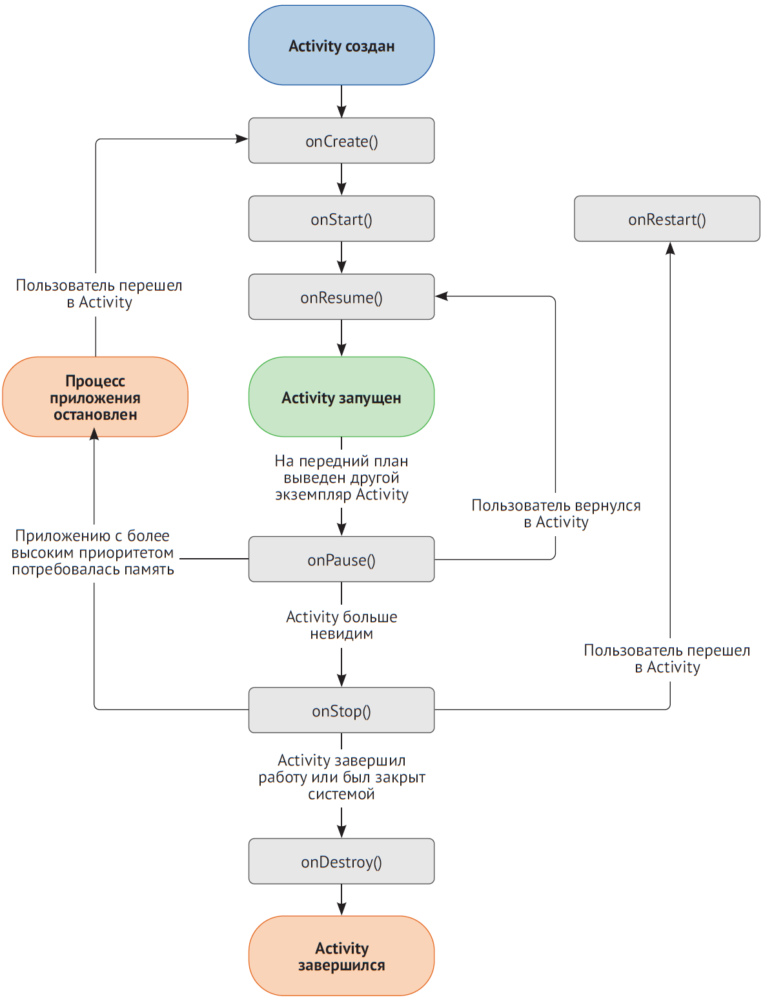

## Подробнее о состояниях Activity

Когда приложение запустится, оно выполнит некоторую логику инициализации и создаст "фон окна" (обычный сплошной цвет, в зависимости от вашего экрана, который можно заменить любым допустимым экземпляром Drawable). Эта работа выполняется в главном потоке и не может быть прервана или приостановлена - она просто будет выполнена.

**Обратите внимание, что если для приложения реализован свой класс `Application`, в этот момент будет вызван его метод `onCreate()`. И снова, важно помнить об этом, вызов произойдет в главном потоке выполнения (его еще называют потоком пользовательского интерфейса), поэтому все остальные операции будут отложены до окончания его выполнения.**

По завершении инициализации приложение запустит один экземпляр класса Activity, который вы определили в манифесте приложения со значением android.intent.category.LAUNCHER в его элементе category. Описание этого экземпляра класса Activity должно также включать элемент action со значением android.intent.action.MAIN, определяющим любую из точек входа в ваше приложение (например, через значок запуска, глубокую ссылку, общесистемные широковещательные сообщения и так далее).

  

Считается, что в процессе взаимодействия с приложением Android пользователь всегда находится в Activity (исключение составляют удаленные операции, такие как взаимодействие строки состояния с Service). Все элементы пользовательского интерфейса должны входить в состав какого-то экземпляра Activity (единственным исключением является класс RemoteViews – небольшое подмножество простых классов View, – доступный в окнах уведомлений).
Обратите внимание, что экземпляры Activity нельзя вкладывать друг в друга. Вообще говоря, один экземпляр Activity занимает сразу весь экран (или, по крайней мере, часть, делегированную приложению).
Как уже упоминалось, вы не должны создавать новые экземпляры Activity; от вас требуется только указать класс Activity, который следует запустить. За кулисами платформа Android создаст нужный экземпляр и выполнит все подготовительные операции, прежде чем отобразить его. Кроме того, эта операция выполняется асинхронно, и система сама решает, когда запустить новый экземпляр Activity.
Это особенно важно, потому что в файле манифеста разным экземплярам Activity могут быть назначены разные режимы запуска. Конкретный режим запуска может позволить одновременно существовать любому количеству экземпляров класса Activity. Например, вы можете разрешить пользователю иметь любое количество экземпляров ComposeEmailActivity в одном стеке задач, и при этом ограничить количество экземпляров других видов Activity, например разрешить только один экземпляр LoginActivity, что может привести к перемещению последнего использовавшегося LoginActivity на вершину стека задач или к уничтожению всего, что находится между текущим экземпляром Activity и последним использовавшимся LoginActivity, в зависимости от режима запуска.

**Подробная информация о режимах запуска находится в документации для разработчиков.**

### Жизненный цикл Activity

По мере прохождения контроллера пользовательского интерфейса через различные состояния, от создания до завершения, вызывается множество его методов жизненного цикла, которые могут послужить отличным средством для получения событий приложения. 
На изображении ниже показана диаграмма из документации, которая послужит нам основой для дальнейшего обсуждения. Когда экземпляр Activity создается впервые, вызывается его метод onCreate().

**Важно понимать, что onCreate() вызывается также при повторном создании Activity. Время от времени система будет отбирать и утилизировать ресурсы приложения, чтобы использовать их для других целей; в таких случаях приложение полностью уничтожается за кулисами, правда, некоторая информация о его текущем состоянии сохраняется на локальном диске.**

Когда Activity создается в первый раз, этому методу передается единственный параметр – пустая ссылка на Bundle. Когда он воссоздается после утилизации ресурсов (как это происходит при «изменении конфигурации», например при повороте устройства или подключении нового экрана), методу onCreate() будет передана непустая ссылка на Bundle.

Когда экземпляр Activity становится видимым (например, после появления из-за другого экземпляра Activity), вызывается метод onStart(). Вызов onStart() всегда следует за вызовом onCreate(), но не всем вызовам onStart() предшествует вызов onCreate(). 

Метод onResume() вызывается каждый раз, когда Activity получает фокус ввода. Экземпляр Activity может потерять фокус, если содержащее его приложение будет свернуто, на передний план будет выведено другое приложение, произойдет телефонный звонок или даже если поверх содержимого Activity появится диалоговое окно, несмотря на то что большая часть этого содержимого все еще будет видна.

После восстановления фокуса ввода – при закрытии другого приложения, прекращении телефонного звонка или закрытии диалога – будет вызван метод onResume(). Метод onResume() всегда следует за onStart(), но не всем событиям onResume() предшествуют события onStart().
Теперь пройдемся по другой ветке, ведущей к уничтожению. Каждый раз, когда Activity теряет фокус ввода (см. onResume()), вызывается метод onPause().

Ситуация с методом onStop() сложнее, его смысл часто искажается в ходе обычного диалога. Метод onStop() вызывается при уничтожении Activity, но он может быть воссоздан заново, например когда система отберет и вновь вернет ресурсы приложению. За onStop() следует событие onDestroy (см. ниже) или onRestart, означающее, что Activity был восстановлен из сохраненных «подсказок» после остановки. Всем событиям onStop предшествует onPause, но не за всеми событиями onPause следует onStop. 

Подробную информацию о жизненном цикле Activity ищите в документации. Вот выдержка из документации: 

*Когда Activity больше не виден пользователю, он переходит в состояние «приостановлен», и система вызывает onStop(). Это может произойти, например, когда вновь запущенный экземпляр Activity охватывает весь экран. Система может также вызвать onStop(), когда Activity завершил работу и вскоре будет уничтожен. Метод onDestroy() вызывается перед уничтожением экземпляра Activity, когда его повторное восстановление не предполагается. Если, находясь в Activity, вы коснетесь кнопки Назад, будет вызван метод onDestroy(). Это подходящее место для освобождения ресурсов. Всем событиям onDestroy() предшествует onStop(), но не за всеми событиями onStop() следует onDestroy().*

В документации четко указано, что нельзя рассчитывать на onDestroy для освобождения объемных ресурсов или выполнения асинхронных операций. Это верно, но многие интерпретируют эти слова как то, что можно рассчитывать на onStop или onPause, однако это не так. Представьте, что ваше устройство попало под колесо грузовика (или, что более вероятно, разрядился аккумулятор). Ваше приложение будет закрыто немедленно, без вызова любых методов обработки событий жизненного цикла и без всяких шансов на освобождение ресурсов. Выполнять такую работу в onPause ничуть не безопаснее, чем в onDestroy. Тем не менее, поскольку вызов onDestroy, как правило, означает, что Activity вскоре будет уничтожен и утилизирован сборщиком мусора, можно не беспокоиться о занятых ресурсах, которые и так будут освобождены.

Контекст в Android
Контекст (Context) - это базовый абстрактный класс, реализация которого обеспечивается системой Android. 
Этот класс имеет методы для доступа к специфичным для конкретного приложения ресурсам и классам и служит для выполнения операций на уровне приложения, таких, как запуск активностей, отправка широковещательных сообщений, получение намерений и прочее. От класса Context наследуются такие крупные и важные классы, как Application, Activity и Service, поэтому все его методы доступны из этих классов.
Контекст является базовым классом для классов Application, Activity и Service, а значит его методы входят в их состав. Именно поэтому для передачи контекста в качестве параметра можно использовать как ссылку на сам контекст (getBaseContext), так и ссылки на наследуемые классы (getApplicationContext, getContext, this, MainActivity.this, getActivity).
Иными словами, контекст – это мостик, связующее звено между вашим приложением и операционной системой. Классы, которые реализуют контекст, создаются операционной системой. Так как Activity является подклассом контекста, то мы можем использовать ссылку на объект Activity (например, через ключевое слово this) как контекст. Также, это справедливо для классов Application и Service, которые мы рассмотрим в следующих лабораторных работах.
Получить доступ к ресурсам приложения, записать или считать файл, получить доступ к компонентам устройства (экран, звук, датчики, кнопки), работать с уведомлениями – для всего этого нужен контекст. В данном случае, нам нужен контекст, чтобы отправить ОС намерение открыть второе окно.
Отличная подробная статья на английском языке - здесь. Также, подробнее читайте про контекст здесь, здесь и здесь.