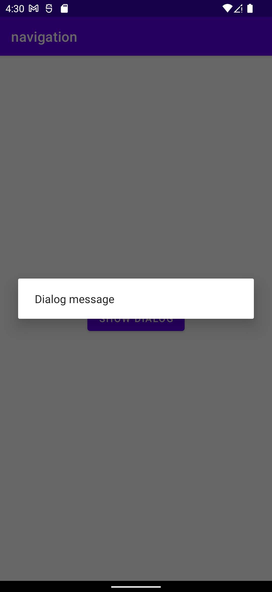
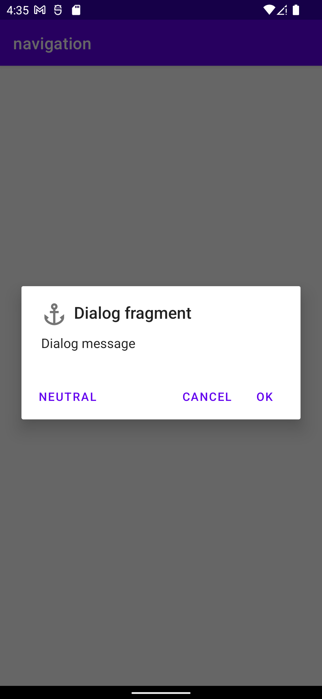

# Диалоговые окна и широковещательные сообщения в Android

Диалоговое окно – это небольшое окно, которое предлагает пользователю принять решение или ввести дополнительную информацию. Диалоги, как правило, не занимают весь экран и используются в событиях, для продолжения которых требуется действие пользователя.

Базовый класс для диалогов – `Dialog`, но его напрямую реализовывать не рекомендуется. Существуют несколько типов диалогов:

- `AlertDialog` – диалоговое окно, в котором могут отображаться заголовок, до трех кнопок, список для выбора либо пользовательский макет;
- `DatePickerDialog` или `TimePickerDialog` – диалоги для выбора даты и времени;
- `BottomSheetDialog` - диалоговое окно в виде всплывающего модального окна снизу экрана;
- `FullScreenDialog` - диалоговое окно, которое занимает весь экран.

В качестве контейнера диалоговых окон следует использовать `DialogFragment`.

## Создание и открытие диалогового окна

Для создания диалога необходимо расширить класс `DialogFragment` и создать `AlertDialog` в callback-методе `onCreateDialog()`.

Рассмотрим работу с диалоговыми окнами на примере. Создадим проект, добавим в макет кнопку, по нажатию на которую появляется диалоговое окно.


Создадим класс фрагмента диалога, в методе `onCreateDialog()` создадим объект диалога и вернем объект диалога.

```kotlin
class ExampleDialog() : DialogFragment() {
    override fun onCreateDialog(savedInstanceState: Bundle?): Dialog {
        return AlertDialog.Builder(requireActivity())
            .setMessage("Dialog message")
            .create()
    }
}
```

***Обратите внимание, что для настройки объекта диалога используется паттерн Builder ("Строитель"), информацию про этот паттерн можно найти [здесь](https://vertex-academy.com/tutorials/ru/pattern-builder-java/).***

Теперь перейдем в класс `MainActivity` и напишем обработчик кнопки. По нажатию на кнопку будет показано диалоговое окно

```kotlin
class MainActivity : AppCompatActivity() {
    override fun onCreate(savedInstanceState: Bundle?) {
        super.onCreate(savedInstanceState)

        val binding = ActivityMainBinding.inflate(layoutInflater)
        setContentView(binding.root)

        binding.button.setOnClickListener {
            val dialog = ExampleDialog()
            dialog.show(supportFragmentManager, "dlg")
        }
    }
}
```

Обратите внимание, что, так как диалоговое окно является фрагментом, для его корректной работы мы должны передать объект `FragmentManager`, который осуществляет управление фрагментами.

Запустим приложение и посмотрим на результат

<p align="center" style="margin:auto">
  
</p>

### Настройка диалогового окна

Android позволяет гибко настроить внешний вид и поведение диалогового окна: вы можете добавить, заголовок, иконку, до трех кнопок, а также менять тип сообщения или даже предоставить свой макет для создания уникальных диалоговых окон.

Давайте попробуем модифицировать наше диалоговое окно. Для этого нам необходимо вернуться в класс диалога и в методе `onCreateDialog()` и добавить нужные компоненты с помощью функций объекта строителя.

```kotlin
class ExampleDialog : DialogFragment() {
    override fun onCreateDialog(savedInstanceState: Bundle?): Dialog {
        return AlertDialog.Builder(requireActivity())
            .setMessage("Dialog message")
            .setIcon(R.drawable.ic_anchor)
            .setTitle("Dialog fragment")
            .setPositiveButton("Ok", null)
            .setNeutralButton("Neutral", null)
            .setNegativeButton("Cancel", null)
            .create()
    }
}
```

Посмотрим на результат
<div align="center" style="margin:auto">
  
</div>

Возможности Android позволяют вам вместо простого сообщения добавить в диалоговое окно группу радиокнопок или чекбоксов. По ссылке [здесь](https://developer.android.com/guide/topics/ui/dialogs) можно посмотреть информацию о видах диалоговых окон и о том, как их создавать.

### Диалоговое окно выбора даты и времени

Отдельно стоит упомянуть про стандартные диалоговое окна для выбора даты (класс DatePickerDialog) и времени (класс TimePickerDialog).

> Выбор даты и времени также реализован в виде отдельных UI виджетов, которые можно поместить в любой макет.

> Для создания диалогового окна для выбора одновременно даты и времени, используйте сторонние библиотеки либо можете реализовать это самостоятельно с помощью собственного макета диалогового окна.

Рассмотрим пример создания диалогового окна для выбора даты. Обратите внимание, что номер возвращаемого месяца начинается с 0, поэтому увеличиваем значение месяца на единицу.

Рассмотрим пример для диалогового окна выбора времени.

## Передача и получение данных из диалога

Так как диалоговое окно "обернуто" в объект фрагмента, то передача данных в диалоговое окно и получение данных из диалогового окна реализуется так же, как и в случае работы с фрагментами.

Рассмотрим небольшой пример в качестве наглядной иллюстрации процесса обмена данными с диалоговым окном. Используем уже созданный проект, данные вводятся в поле ввода, после чего они передаются в диалоговое окно. Результат работы диалогового окна передается обратно в Activity, которое вызвало диалоговое окно.

## Широковещательные сообщения. Прием и отсылка сообщений

Широковещательные сообщения – механизм оповещения приложений о наступлении определенных событий.  Пользовательские приложения могут отправлять и получать сообщения от других приложений, а также могут получать сообщения от системных приложений Android. Также, широковещательные сообщения могут предназначаться другим компонентам этого же приложения (например, один из способов взаимодействия `Service` и `Activity` это обмен широковещательными сообщениями).

***Дополнительная информация по поводу широковещательных сообщений доступна [здесь](https://developer.android.com/guide/components/broadcasts).***

Механизм широковещательных сообщений реализуется и поддерживается средствами операционной системы (операционная система выступает в роли «брокера сообщений»). Все сообщения отсылаются через контекст «в операционную систему», а все желающие получать сообщения должны быть зарегистрированы в операционной системе.

Основные сценарии использования механизма широковещательных сообщений:

- Реакция на системные события и на события устройства (основной сценарий использования широковещательных сообщений);
- Обмен сообщениями между приложениями (как правило, оба приложения должны быть написаны вами, так как чтобы принять сообщение, необходимо точно знать его идентификатор);
- Обмен сообщениями между компонентами одного приложения (обмен сообщениями между service и activity или между service).

Примеров использования широковещательных сообщений много – ОС рассылает сообщения при наступлении различных системных событий (количество таких событий очень велико), приложения могут рассылать сообщения, если произошло некоторое событие, которое может быть интересно другим приложениям (например, появление новых данных, загрузка файла) и так далее.
Работа механизма широковещательных сообщений основана на модели publisher-subscriber («подписчик-издатель»), поэтому нам необходимо отдельно рассмотреть вопрос отсылки и приема широковещательного сообщения.

***Модель «подписчик-издатель» в последнее время активно используется в «интернете вещей», в микросервисах, в различных протоколах вроде MQTT и технологиях обмена сообщениями вроде JMS и во многих других областях. Более подробно про эту модель читайте [здесь](https://ru.wikipedia.org/wiki/Издатель-подписчик_(шаблон_проектирования)) и [здесь](https://habr.com/ru/post/270339/).***

### Широковещательные сообщения и их отправка

Давайте сначала разберемся, что же собой представляет само сообщение. Оберткой для широковещательного сообщения служит объект класса Intent.
Очень важным параметром намерения является параметр action. В этом параметре указывается идентификатор сообщения (некоторая строка, как правило, сформированная определенным образом). Например для системного сообщения об изменении режима «airplane mode» идентификатором является строка «android.intent.action.AIRPLANE_MODE»). Именно идентификатор сообщения служит способом получить это сообщение в дальнейшем.
С помощью методов putExtra() и объекта Bundle можно передать данные в виде каких-то значений, но часто бывает достаточно самого факта прихода сообщения, чтобы ваше приложение отреагировало. Например, вместе с сообщением об изменении режима «airplane mode», система передает переменную, которая дает нам информацию о том, был ли режим «airplane mode» включен или выключен.
Как уже было сказано, механизм широковещательных сообщений реализуется средствами операционной системы, поэтому для отсылки сообщения нам необходимо иметь контекст, чтобы воспользоваться специальным методом sendBroadcast().
Таким образом, чтобы выслать широковещательное сообщение, необходимо выполнить следующие действия:

1. создать объект типа Intent;
2. с помощью метода setAction() указать action сообщения;
3. с помощью методов putExtra() добавить данные (если они нужны);
4. с помощью метода Context.sendBroadcast() выслать сообщение.

Создадим тестовый проект и по нажатию кнопки отправим широковещательное сообщение

### Приемник широковещательных сообщений

Для приема широковещательных сообщений нам необходимо создать **приемник широковещательных сообщений** (**Broadcast Receiver**). Broadcast Receiver – это класс, который создается разработчиком, и чья задача состоит в получении широковещательного сообщения и реагировании на него.

Приемник ШС является отдельным компонентом приложения, так как может быть запущен отдельно от Activity, Service и Content Provider и может являться стартовой точкой приложения. В некоторых случаях, приемник ШС может быть запущен операционной системой и сам запустить стартовое Activity.

Для начала, создадим «заготовку» для приемника ШС. По традиции, для создания собственного компонента, нам необходимо отнаследоваться от стандартного класса приемника ШС, который называется BroadcastReceiver. Класс BroadcastReceiver является абстрактным, поэтому нам необходимо реализовать метод onReceive(), который будет вызван, когда приемник получит широковещательное сообщение.

Давайте теперь поговорим о ключевой составляющей приемника ШС – это подписка приемника на широковещательные сообщения. Так как для ШС используется модель «издатель-подписчик», то наш «подписчик», он же приемник, должен явно указать брокеру сообщений (то бишь, нашей операционной системе), на какие события он «подписывается», то есть сообщения с каким идентификатором он принимает.

Идентификатор, как вы помните, указывается с помощью метода setAction(). Таким образом, если вы хотите, чтобы ваше приложение А высылало сообщения приложению Б, тогда в сообщении из приложения A должен быть указан тот же идентификатор, на который должен подписаться приемник из приложения Б.
Приемник ШС можно использовать двумя способами: объявить в манифесте, зарегистрировать с помощью контекста. Эти два способа использования приемника существенно отличаются друг от друга. Рассмотрим каждый из этих способов.

#### Объявление приемника в манифесте приложения

Приемник, объявленный в манифесте, регистрируется при установке приложения и имеет жизненный цикл, независимый от других компонентов. Такой приемник может служить точкой входа в приложение. Если такой приемник получает сообщения, ОС запускает приложение и создает объект приемника ШС. Для каждого полученного сообщения, создается свой объект приемника. Как только метод onReceive() отработает, объект приемника уничтожается.

***В последних версиях Android, сценарии использования приемника, который регистрируется в манифесте, существенно ограничены. Существует определенный перечень широковещательных сообщений, которые может принимать приемник, который регистрируется в манифесте. Список таких сообщений можно посмотреть [здесь](https://developer.android.com/guide/components/broadcast-exceptions.html). На другие сообщения такой приемник реагировать не будет (кроме ШС, которые явно адресованы вашему приложению).***

Чтобы объявить приемник в манифесте, необходимо указать элемент `<receiver>`, где указать класс приемника. Внутри элемента `<receiver>` необходимо указать элемент `<intent-filter>`, где необходимо указать, на какие широковещательные сообщения подписывается приемник.

К примеру, создадим приложение которое будет реагировать на системное событие `ACTION_BOOT_COMPLETED`, которое рассылается системой один раз после того как устройство загрузилось и готово к работе.

Для начала создадим класс приемника широковещательных сообщений.

Далее, заходим в манифест приложения, добавляем разрешение на прием сообщения типа `ACTION_BOOT_COMPLETED`, а также регистрируем приемник в теге `<application>`, при регистрации указываем, на какие события подписывается приемник.

Далее редактируем содержимое класса `MainActivity`

Запускаем приложение, после чего перезагружаем устройство

#### Регистрация приемника в методах жизненного цикла контекста

Такой вариант регистрации является основным и целесообразен, если реакция на сообщение напрямую связана с этим контекстом. Например, мы хотим как-то отобразить в Activity факт прихода сообщения или какие-то данные, которые пришли к нам вместе с сообщением. Или сообщения каким-то образом влияют на работу запущенной вами службы.

Регистрацию приемника и снятие его с регистрации следует проводить в парных методах жизненного цикла (onCreate() - onDestroy(), onStart() - onStop(), onResume() - onPause() и так далее).

В качестве примера создадим приложение и добавим приемник для получения SMS-сообщений и их последующей обработки.

Для начала создадим класс приемника сообщений

Далее создадим в `MainActivity` поле класса - объект приемника. Регистрация будет происходить в методе `onStart()`, снятие с регистрации - в методе `onStop()`.

Обратите внимание, что для регистрации приемника мы должны предусмотреть объект IntentFilter. Он необходим для указания параметра action тех сообщений, которые мы хотим получать.