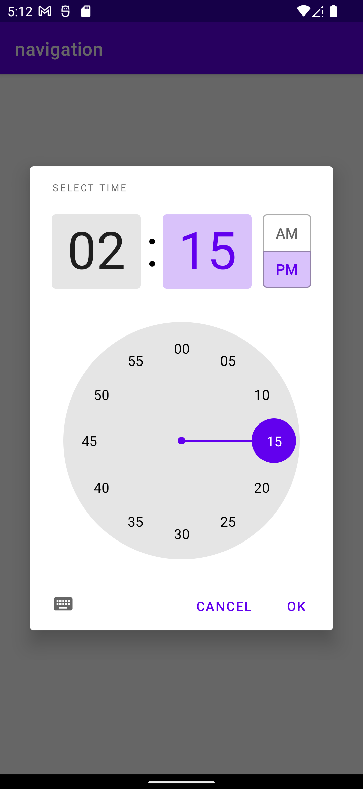
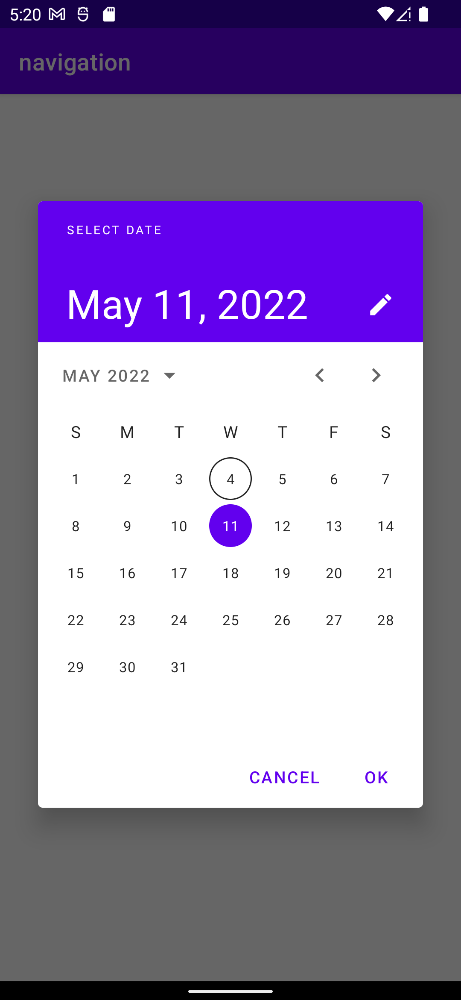
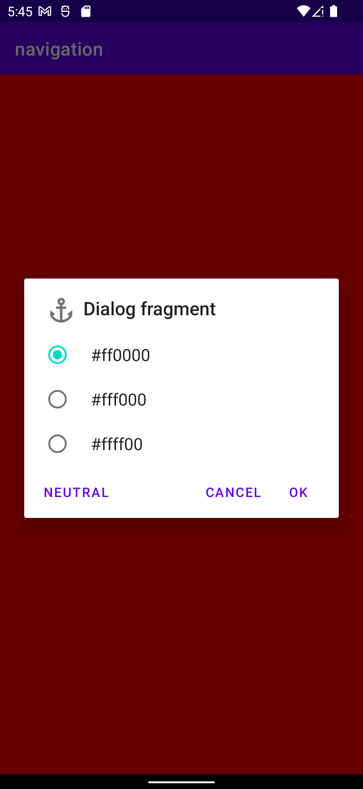

# Диалоговые окна в Android

Диалоговое окно – это небольшое окно, которое предлагает пользователю принять решение или ввести дополнительную информацию. Диалоги, как правило, не занимают весь экран и используются в событиях, для продолжения которых требуется действие пользователя.

Базовый класс для диалогов – `Dialog`, но его напрямую реализовывать не рекомендуется. Существуют несколько типов диалогов:

- `AlertDialog` – диалоговое окно, в котором могут отображаться заголовок, до трех кнопок, список для выбора либо пользовательский макет;
- `DatePickerDialog` или `TimePickerDialog` – диалоги для выбора даты и времени;
- `BottomSheetDialog` - диалоговое окно в виде всплывающего модального окна снизу экрана;
- `FullScreenDialog` - диалоговое окно, которое занимает весь экран.

В качестве контейнера диалоговых окон следует использовать `DialogFragment`.

## Создание и открытие диалогового окна

Для создания диалога необходимо расширить класс `DialogFragment` и создать `AlertDialog` в callback-методе `onCreateDialog()`.

Рассмотрим работу с диалоговыми окнами на примере. Создадим проект, добавим в макет кнопку, по нажатию на которую появляется диалоговое окно.

Создадим класс фрагмента диалога, в методе `onCreateDialog()` создадим объект диалога и вернем объект диалога.

```kotlin
class ExampleDialog() : DialogFragment() {
    override fun onCreateDialog(savedInstanceState: Bundle?): Dialog {
        return AlertDialog.Builder(requireActivity())
            .setMessage("Dialog message")
            .create()
    }
}
```

***Обратите внимание, что для настройки объекта диалога используется паттерн Builder ("Строитель"), информацию про этот паттерн можно найти [здесь](https://vertex-academy.com/tutorials/ru/pattern-builder-java/).***

Теперь перейдем в класс `MainActivity` и напишем обработчик кнопки. По нажатию на кнопку будет показано диалоговое окно

```kotlin
class MainActivity : AppCompatActivity() {
    override fun onCreate(savedInstanceState: Bundle?) {
        super.onCreate(savedInstanceState)

        val binding = ActivityMainBinding.inflate(layoutInflater)
        setContentView(binding.root)

        binding.button.setOnClickListener {
            val dialog = ExampleDialog()
            dialog.show(supportFragmentManager, "dlg")
        }
    }
}
```

Обратите внимание, что, так как диалоговое окно является фрагментом, для его корректной работы мы должны передать объект `FragmentManager`, который осуществляет управление фрагментами.

Запустим приложение и посмотрим на результат

<p align="center" style="margin:auto">
  
</p>

### Настройка диалогового окна

Android позволяет гибко настроить внешний вид и поведение диалогового окна: вы можете добавить, заголовок, иконку, до трех кнопок, а также менять тип сообщения или даже предоставить свой макет для создания уникальных диалоговых окон.

Давайте попробуем модифицировать наше диалоговое окно. Для этого нам необходимо вернуться в класс диалога и в методе `onCreateDialog()` и добавить нужные компоненты с помощью функций объекта строителя.

```kotlin
class ExampleDialog : DialogFragment() {
    override fun onCreateDialog(savedInstanceState: Bundle?): Dialog {
        return AlertDialog.Builder(requireActivity())
            .setMessage("Dialog message")
            .setIcon(R.drawable.ic_anchor)
            .setTitle("Dialog fragment")
            .setPositiveButton("Ok", null)
            .setNeutralButton("Neutral", null)
            .setNegativeButton("Cancel", null)
            .create()
    }
}
```

Посмотрим на результат
<div align="center" style="margin:auto">
  
</div>

Возможности Android позволяют вам вместо простого сообщения добавить в диалоговое окно группу радиокнопок или чекбоксов. По ссылке [здесь](https://developer.android.com/guide/topics/ui/dialogs) можно посмотреть информацию о видах диалоговых окон и о том, как их создавать.

### Диалоговое окно выбора даты и времени

Отдельно стоит упомянуть про стандартные диалоговое окна для выбора даты (класс `DatePickerDialog`) и времени (класс `TimePickerDialog`).

> Выбор даты и времени также реализован в виде отдельных UI виджетов, которые можно поместить в любой макет.

> Для создания диалогового окна для выбора одновременно даты и времени, используйте сторонние библиотеки либо можете реализовать это самостоятельно с помощью собственного макета диалогового окна.

Рассмотрим пример создания диалогового окна для выбора даты. Обратите внимание, что номер возвращаемого месяца начинается с 0, поэтому увеличиваем значение месяца на единицу.

```kotlin
class MainActivity : AppCompatActivity() {
    override fun onCreate(savedInstanceState: Bundle?) {
        super.onCreate(savedInstanceState)

        val binding = ActivityMainBinding.inflate(layoutInflater)
        setContentView(binding.root)

        val is24 = android.text.format.DateFormat.is24HourFormat(this)
        val clockFormat = if (is24) TimeFormat.CLOCK_24H else TimeFormat.CLOCK_12H

        val picker = MaterialTimePicker.Builder()
            .setTimeFormat(clockFormat)
            .setHour(12)
            .setMinute(12)
            .setTitleText("Select time")
            .build()

        picker.addOnPositiveButtonClickListener {
            val hour = picker.hour
            val minutes = picker.minute
            Toast.makeText(this, "$hour : $minutes", Toast.LENGTH_SHORT).show()
        }

        binding.button.setOnClickListener {
            picker.show(supportFragmentManager, "picker")
        }
    }

```

Проверим результат

<div align="center" style="margin:auto">
  
</div>


Рассмотрим пример для диалогового окна выбора времени.

```kotlin
class MainActivity : AppCompatActivity() {
    override fun onCreate(savedInstanceState: Bundle?) {
        super.onCreate(savedInstanceState)

        val binding = ActivityMainBinding.inflate(layoutInflater)
        setContentView(binding.root)
        
        val picker = MaterialDatePicker.Builder.datePicker()
            .setInputMode(MaterialDatePicker.INPUT_MODE_CALENDAR)
            .build()

        picker.addOnPositiveButtonClickListener {
            val outputDateFormat = SimpleDateFormat("dd.MM.yyyy", Locale.getDefault()).apply {
                timeZone = TimeZone.getTimeZone("UTC")
            }
            Toast.makeText(this, outputDateFormat.format(it), Toast.LENGTH_SHORT).show()
        }

        binding.button.setOnClickListener {
            picker.show(supportFragmentManager, "picker")
        }
    }
}
```

Проверим результат

<div align="center" style="margin:auto">
  
</div>

## Передача и получение данных из диалога

Так как диалоговое окно "обернуто" в объект фрагмента, то передача данных в диалоговое окно и получение данных из диалогового окна реализуется так же, как и в случае работы с фрагментами.

Рассмотрим небольшой пример в качестве наглядной иллюстрации процесса обмена данными с диалоговым окном.

```kotlin
class ExampleDialog : DialogFragment() {

    lateinit var listener: ExampleDialogListener

    interface ExampleDialogListener {
        fun onDialogResult(color: String)
    }

    private lateinit var colors: Array<String>

    override fun onCreate(savedInstanceState: Bundle?) {
        super.onCreate(savedInstanceState)

        colors = arguments?.getStringArray("array") as Array<String>
    }

    private var selected: Int = 0

    override fun onCreateDialog(savedInstanceState: Bundle?): Dialog {
        return AlertDialog.Builder(requireActivity())
            .setSingleChoiceItems(
                colors, 0
            ) { _, i -> selected = i }
            .setIcon(R.drawable.ic_anchor)
            .setTitle("Dialog fragment")
            .setPositiveButton("Ok") { _, id -> listener.onDialogResult(colors[selected]) }
            .setNeutralButton("Neutral", null)
            .setNegativeButton("Cancel", null)
            .create()
    }

    override fun onAttach(context: Context) {
        super.onAttach(context)

        try {
            listener = context as ExampleDialogListener
        } catch (e: ClassCastException) {
        }
    }

    companion object {
        fun newInstance(array: Array<String>): ExampleDialog {
            val args = Bundle()
            args.putStringArray("array", array)
            val fragment = ExampleDialog()
            fragment.arguments = args
            return fragment
        }
    }
}
```

Класс MainActivity

```kotlin
class MainActivity : AppCompatActivity(), ExampleDialog.ExampleDialogListener {

    lateinit var binding: ActivityMainBinding

    override fun onCreate(savedInstanceState: Bundle?) {
        super.onCreate(savedInstanceState)

        binding = ActivityMainBinding.inflate(layoutInflater)
        setContentView(binding.root)


        val colors = arrayOf("#ff0000", "#fff000", "#ffff00")

        binding.button.setOnClickListener {
            val dialog = ExampleDialog.newInstance(colors)
            dialog.show(supportFragmentManager,"dlg")
        }
    }

    override fun onDialogResult(color: String) {
        binding.root.setBackgroundColor(Color.parseColor(color))
    }
}
```

Посмотрим на результат

<div align="center" style="margin:auto">
  
</div>