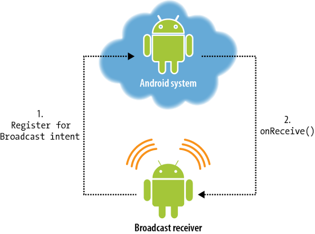

# Широковещательные сообщения и уведомления.

## Теоретическая часть

Широковещательные сообщения – механизм оповещения приложений о наступлении определенных событий.  Пользовательские приложения могут отправлять и получать сообщения от других приложений, а также могут получать сообщения от системных приложений Android. Также, широковещательные сообщения могут предназначаться другим компонентам этого же приложения (например, один из способов взаимодействия `Service` и `Activity` это обмен широковещательными сообщениями).

  

Механизм широковещательных сообщений реализуется и поддерживается средствами операционной системы (операционная система выступает в роли «брокера сообщений»). Все сообщения отсылаются через контекст «в операционную систему», а все желающие получать сообщения должны быть зарегистрированы в операционной системе.

Основные сценарии использования механизма широковещательных сообщений:

- Реакция на системные события и на события устройства (основной сценарий использования широковещательных сообщений);
- Обмен сообщениями между приложениями (как правило, оба приложения должны быть написаны вами, так как чтобы принять сообщение, необходимо точно знать его идентификатор);
- Обмен сообщениями между компонентами одного приложения (обмен сообщениями между service и activity или между service).

Примеров использования широковещательных сообщений много – ОС рассылает сообщения при наступлении различных системных событий (количество таких событий очень велико), приложения могут рассылать сообщения, если произошло некоторое событие, которое может быть интересно другим приложениям (например, появление новых данных, загрузка файла) и так далее.
Работа механизма широковещательных сообщений основана на модели publisher-subscriber («подписчик-издатель»), поэтому нам необходимо отдельно рассмотреть вопрос отсылки и приема широковещательного сообщения.

### Широковещательные сообщения и их отправка

Давайте сначала разберемся, что же собой представляет само сообщение. Оберткой для широковещательного сообщения служит объект класса `Intent`.

Очень важным параметром намерения является параметр `action`. В этом параметре указывается идентификатор сообщения (некоторая строка, как правило, сформированная определенным образом). Например для системного сообщения об изменении режима «airplane mode» идентификатором является строка `android.intent.action.AIRPLANE_MODE`). Именно идентификатор сообщения служит способом получить это сообщение в дальнейшем.

С помощью методов `putExtra()` и объекта `Bundle` можно передать данные в виде каких-то значений, но часто бывает достаточно самого факта прихода сообщения, чтобы ваше приложение отреагировало. Например, вместе с сообщением об изменении режима «airplane mode», система передает переменную, которая дает нам информацию о том, был ли режим «airplane mode» включен или выключен.

Как уже было сказано, механизм широковещательных сообщений реализуется средствами операционной системы, поэтому для отсылки сообщения нам необходимо иметь контекст, чтобы воспользоваться специальным методом `sendBroadcast()`.

Таким образом, чтобы выслать широковещательное сообщение, необходимо выполнить следующие действия:

1. создать объект типа Intent;
2. с помощью метода `setAction()` указать action сообщения;
3. с помощью методов `putExtra()` добавить данные (если они нужны);
4. с помощью метода `Context.sendBroadcast()` выслать сообщение.

Широковещательные сообщения могут быть явными (explicit) и неявными (implicit):

- неявное широковещательное сообщение (implicit broadcast) - это сообщение, которое не предназначается специально для вашего приложения, поэтому она не является эксклюзивной для вашего приложения. Из-за этого поведения, неявные широковещательные сообщения не имеют целевого атрибута. Примером неявного сообщения может быть входящее SMS-сообщения;
- явное широковещательное сообщение (explicit broadcast) - это то, что предназначается специально для вашего приложения на заранее известном компоненте.

Есть три способа отправки сообщений:

### Приемник широковещательных сообщений

Для приема широковещательных сообщений нам необходимо создать **приемник широковещательных сообщений** (**Broadcast Receiver**). Broadcast Receiver – это класс, который создается разработчиком, и чья задача состоит в получении широковещательного сообщения и реагировании на него.

Приемник ШС является отдельным компонентом приложения, так как может быть запущен отдельно от Activity, Service и Content Provider и может являться стартовой точкой приложения. В некоторых случаях, приемник ШС может быть запущен операционной системой и сам запустить стартовое Activity.

Для начала, создадим «заготовку» для приемника ШС. По традиции, для создания собственного компонента, нам необходимо отнаследоваться от стандартного класса приемника ШС, который называется `BroadcastReceiver`. Класс `BroadcastReceiver` является абстрактным, поэтому нам необходимо реализовать метод `onReceive()`, который будет вызван, когда приемник получит широковещательное сообщение.

Давайте теперь поговорим о ключевой составляющей приемника ШС – это подписка приемника на широковещательные сообщения. Так как для ШС используется модель «издатель-подписчик», то наш «подписчик», он же приемник, должен явно указать брокеру сообщений (то бишь, нашей операционной системе), на какие события он «подписывается», то есть сообщения с каким идентификатором он принимает.

Идентификатор, как вы помните, указывается с помощью метода setAction(). Таким образом, если вы хотите, чтобы ваше приложение А высылало сообщения приложению Б, тогда в сообщении из приложения A должен быть указан тот же идентификатор, на который должен подписаться приемник из приложения Б.
Приемник ШС можно использовать двумя способами: объявить в манифесте, зарегистрировать с помощью контекста. Эти два способа использования приемника существенно отличаются друг от друга. Рассмотрим каждый из этих способов.

#### Объявление приемника в манифесте приложения

Приемник, объявленный в манифесте, регистрируется при установке приложения и имеет жизненный цикл, независимый от других компонентов. Такой приемник может служить точкой входа в приложение. Если такой приемник получает сообщения, ОС запускает приложение и создает объект приемника ШС. Для каждого полученного сообщения, создается свой объект приемника. Как только метод onReceive() отработает, объект приемника уничтожается.

Чтобы объявить приемник в манифесте, необходимо указать элемент `<receiver>`, где указать класс приемника. Внутри элемента `<receiver>` необходимо указать элемент `<intent-filter>`, где необходимо указать, на какие широковещательные сообщения подписывается приемник.

К примеру, создадим приложение которое будет реагировать на системное событие `ACTION_BOOT_COMPLETED`, которое рассылается системой один раз после того как устройство загрузилось и готово к работе.

Для начала создадим класс приемника широковещательных сообщений.

Далее, заходим в манифест приложения, добавляем разрешение на прием сообщения типа `ACTION_BOOT_COMPLETED`, а также регистрируем приемник в теге `<application>`, при регистрации указываем, на какие события подписывается приемник.

Далее редактируем содержимое класса `MainActivity`

Запускаем приложение, после чего перезагружаем устройство

#### Регистрация приемника в методах жизненного цикла контекста

Такой вариант регистрации является основным и целесообразен, если реакция на сообщение напрямую связана с этим контекстом. Например, мы хотим как-то отобразить в Activity факт прихода сообщения или какие-то данные, которые пришли к нам вместе с сообщением. Или сообщения каким-то образом влияют на работу запущенной вами службы.

Регистрацию приемника и снятие его с регистрации следует проводить в парных методах жизненного цикла (onCreate() - onDestroy(), onStart() - onStop(), onResume() - onPause() и так далее).

В качестве примера создадим приложение и добавим приемник для получения SMS-сообщений и их последующей обработки.

Для начала создадим класс приемника сообщений

Далее создадим в `MainActivity` поле класса - объект приемника. Регистрация будет происходить в методе `onStart()`, снятие с регистрации - в методе `onStop()`.

Обратите внимание, что для регистрации приемника мы должны предусмотреть объект IntentFilter. Он необходим для указания параметра action тех сообщений, которые мы хотим получать.

## Дополнительные материалы

1. Дополнительная информация по поводу широковещательных сообщений - [ссылка](https://developer.android.com/guide/components/broadcasts).

2. Дополнительная информация по поводу модели "подписчик-издатель" - [ссылка 1](https://ru.wikipedia.org/wiki/Издатель-подписчик_(шаблон_проектирования)) и [ссылка 2](https://habr.com/ru/post/270339/).

3. Список явных широковещательных сообщений, которые можно получать с помощью приемника, зарегистрированного в манифесте приложения - [ссылка](https://developer.android.com/guide/components/broadcast-exceptions).
