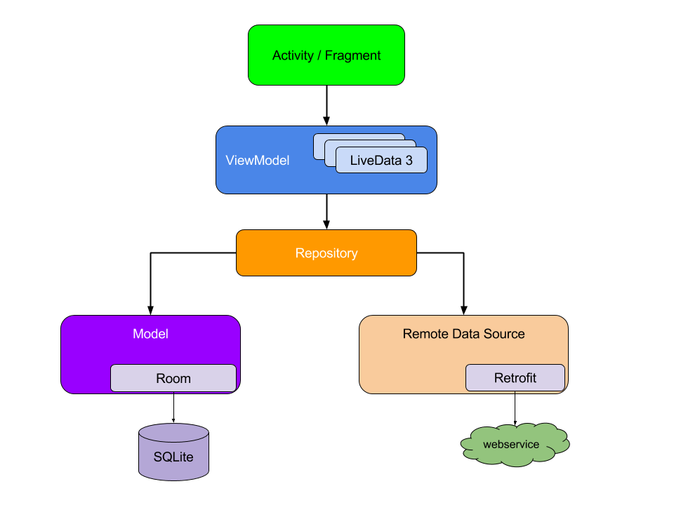

# Навигация в Android. Навигация с помощью фрагментов. Библиотека Navigation Architecture Component

Навигация позволяет пользователю перемещаться между экранами приложения для выполнения различных задач. Навигацию можно осуществить несколькими способами:

- с помощью отдельных навигационных компонентов;
- встроенная в содержимое окна навигация (нажатие на кнопку для перехода);
- возможности платформы Android.

Направления навигации

В зависимости от способа подачи информации в приложении, пользователь может двигаться в одном из трех направлений:

**Боковая навигация** относится к перемещению между экранами на одном уровне иерархии. Основной навигационный компонент приложения должен предоставлять доступ ко всем пунктам назначения на верхнем уровне его иерархии.

  

Навигация вперед относится к перемещению между экранами на последовательных уровнях иерархии, шагам в потоке или по приложению. Навигация вперед встраивает поведение навигации в контейнеры (такие как карточки, списки или изображения), кнопки, ссылки или с помощью поиска.
Обратная навигация означает перемещение назад по экранам либо в хронологическом порядке (в одном приложении или в разных приложениях), либо в иерархическом порядке (внутри приложения). Соглашения о платформе определяют точное поведение обратной навигации в приложении.

Библиотека Navigation Architecture Component позволяет пользователям перемещаться между различными частями контента в приложении.

Компонент навигации входит в набор компонентов Android Jetpack и помогает реализовать навигацию, от простых нажатий кнопок до более сложных шаблонов, таких как панели приложений (appbar) и панель навигации (navigation drawer).